# Discovery log

Observations, measurements, side effects, sources and decisions, in the order they happened. The
rules for this file are in [AGENTS.md](AGENTS.md) §"DISCOVERY.md is an append-only log": new entries
go at the end, and an existing entry is never edited.

---

## 2026-09-13 — Repository seeded (`d8c8f44`)

- README.md, AGENTS.md/CLAUDE.md, `.gitignore` and `.github/workflows/ci.yml` were adapted from the
  `modaal-agent-skills` repository. Left out: the skill rules and `scripts/check-skills.sh`,
  `.claude-plugin/`, the pull-request rules, CONTRIBUTING.md, SECURITY.md and LICENSE.
- `ci.yml` keeps only the `rules` job (`cmp AGENTS.md CLAUDE.md`).
- `_assets/IMG_0210.PNG` … `IMG_0213.PNG` were committed. They show a real school name and a child's
  first name. AGENTS.md §"Two builds of one shell" keeps those names out of every other file; the
  images themselves need replacing or blurring before the repository is pushed to a public remote.
- `ionic-capacitor/` and `native-swift/` were empty directories, so git does not track them.

## 2026-09-13 — `ArrangementView` and the iPad split-view idioms

- Question asked: does SwiftUI use `ArrangementView` to open master-detail pages, and is there an
  iPad split-view idiom already supported?
- `ArrangementView` is described in Apple tech talk 111463: a primary and a secondary view,
  `.arrangementViewStyle(.split)` or `.overlay`, system arrangements from iOS 27.1, no navigation
  infrastructure, and "avoid putting navigation containers like NavigationSplitView inside one".
- `grep` over the SwiftUI, SwiftUICore and UIKit `arm64e-apple-ios.swiftinterface` files of the iOS
  26.5 SDK (Xcode 26.6) and the iOS 27.0 SDK (Xcode 27.0): `ArrangementView` is in neither.
  `NavigationSplitView` (iOS 16), `Tab` and `TabRole` (iOS 18), `.sidebarAdaptable` and
  `tabBarMinimizeBehavior` (iOS 26) are in both. `defaultTabBarPlacement(_:)` and `TabRole.prominent`
  are only in the iOS 27.0 SDK. Line numbers: spec 001 §1.4.
- Outcome: list and detail use `NavigationSplitView`; `ArrangementView` is tried in phase 5 on
  Calendar (spec 001 D3).
- `https://developer.apple.com/documentation/swiftui/arrangementview` returned HTTP 404.
- Apple's HIG page "Designing for iPhone Duo" returned only its title through WebFetch.
- WebFetch returns a model-written summary of a page, not its text. Quotes in spec 001 §1.5 came
  through that summary; the transcripts need re-reading before a phase depends on an exact spelling.
- Third-party articles name APIs and dates that no Apple page read on this date confirms:
  `onHingeChange`, `sceneAccessory`, `CameraCaptureAccessory`, and an October 23 ship date. Spec 001
  does not rely on them.

## 2026-09-13 — Toolchain on this machine

- Node 20.19.5 is installed. Capacitor 8 requires Node 22 or later (Capacitor 8 upgrade guide), so
  phase 2 starts with a Node upgrade.
- Two Xcodes: 26.6 (17F113, selected by `xcode-select`) and 27.0 (27A266a) at
  `<xcode-installs>/7882741C-…/Xcode.app`, outside `/Applications`.
- Side effect: `xcrun simctl list devicetypes` run with Xcode 27.0's `DEVELOPER_DIR` installed
  CoreSimulator 1171.7 over 1169.1. To inspect an Xcode bundle without installing components, read
  the files inside the bundle instead of running `simctl` through it.
- No iPhone Duo simulator device type is installed. Apple's talk 111461 places the iPhone Duo
  simulator in Device Hub in Xcode 27.1.
- Capacitor 8's `npx cap add ios` creates a Swift Package Manager project by default.
- The XcodeGen reference, `modaal-agent/duet-tutorials` at `511b22b`, ignores `*.xcodeproj`
  (`.gitignore:10`) and generates the project from `tutorial3-start/src-ios/App/xcodegen.yml`.

## 2026-09-13 — Ionic and a Liquid Glass tab bar

- Ionic Framework 8.8's announcement states that no official Liquid Glass theme is planned. Ionic 9
  (announced 2026-08-19, 9.0.3 on npm) uses React Router 6 for `@ionic/react-router`.
- `ion-tab-bar` is HTML rendered in the web view.
- `alistairheath/stay-liquid` draws a native Liquid Glass tab bar over the web view. It installs from
  its GitHub URL, renders only the tab bar, had 48 stars, and its README does not mention an iPad
  sidebar.
- The tab bar in the screenshots is flat and full-width. A system SwiftUI `TabView` built with the
  iOS 26 SDK draws the floating Liquid Glass bar, so the two differ (spec 001 D8).

## 2026-09-13 — Sources read for spec 001

"Fetched" means read with WebFetch (a summary of the page). "Search result" means seen only in a web
search result summary.

| source | read | what was taken from it |
| --- | --- | --- |
| [Get Ready for iPhone Duo](https://developer.apple.com/iphone-duo/) | fetched | Xcode 27.1 beta and "Preparing your app for iPhone Duo" listed as "coming later this month"; links to talks 111461–111466 |
| [Prepare your app for iPhone Duo (111461)](https://developer.apple.com/videos/play/tech-talks/111461/) | fetched | inner display regular in both size classes, ignores supported orientations; containers "fully adaptive across every pose"; `defaultTabBarPlacement(.sidebar)`; vertical bars with the iOS 27.1 SDK; Device Hub simulator in Xcode 27.1 |
| [Raise the bar with iPhone Duo (111462)](https://developer.apple.com/videos/play/tech-talks/111462/) | fetched | bars on a vertical axis; `toolbarVerticalCompressionBehavior(.prefersToolbarItems)`; `toolbarVerticalBehavior(.disabled)` |
| [Strike a pose with adaptive layouts on iPhone Duo (111463)](https://developer.apple.com/videos/play/tech-talks/111463/) | fetched | `ArrangementView`, `.split`/`.overlay`, `UIArrangementViewController`, iOS 27.1, reserved regions `.division` and `.occlusion`, do not nest `NavigationSplitView` |
| [Leverage multiple displays and scenes (111464)](https://developer.apple.com/videos/play/tech-talks/111464/), [camera (111465)](https://developer.apple.com/videos/play/tech-talks/111465/), [Design for iPhone Duo (111466)](https://developer.apple.com/videos/play/tech-talks/111466/) | search result | not read |
| [HIG: Designing for iPhone Duo](https://developer.apple.com/design/human-interface-guidelines/designing-for-iphone-duo) | fetched | title only |
| [WWDC25: Build a SwiftUI app with the new design](https://developer.apple.com/videos/play/wwdc2025/323/) | search result | standard bars take Liquid Glass when built with the iOS 26 SDK |
| [Capacitor: Updating to 8.0](https://capacitorjs.com/docs/updating/8-0) | fetched | Xcode 26.0+, Node 22+, iOS deployment target 15.0, SPM default, `--packagemanager CocoaPods` |
| [Capacitor: Swift Package Manager](https://capacitorjs.com/docs/ios/spm) | fetched | SPM selectable since Capacitor 6, `npx cap add ios --packagemanager SPM` |
| [Announcing Ionic Framework 9](https://ionic.io/blog/announcing-ionic-framework-9) | fetched | 2026-08-19; React 18+ with React Router 6; Vue 3.5+ with Vue Router 5; Angular 18–22 |
| [Announcing Ionic Framework 8.8](https://ionic.io/blog/announcing-ionic-framework-8-8) | search result | no official Liquid Glass theme planned |
| [ion-split-pane](https://ionicframework.com/docs/api/split-pane) | fetched | `when` default `(min-width: 992px)`; `xs`–`xl` breakpoints; `contentId` |
| [ionic start](https://ionicframework.com/docs/cli/commands/start) | fetched | command syntax, `--type`, `tabs` template, `--capacitor` |
| [alistairheath/stay-liquid](https://github.com/alistairheath/stay-liquid) | fetched | native tab bar over the web view; GitHub-URL install; iOS 26+; 48 stars |
| [dev.to: iPhone Duo for iOS Developers](https://dev.to/arshtechpro/iphone-duo-for-ios-developers-what-actually-changes-in-your-swift-code-5gc5) | fetched | third party; API names cross-checked against Apple's talks, the rest not relied on |
| [Swift with Majid: SwiftUI after WWDC26](https://swiftwithmajid.com/2026/06/08/what-is-new-in-swiftui-after-wwdc26/) | fetched | `Tab(…, role: .prominent)`; no mention of `ArrangementView` |
| [Exploring tab bars on iOS 26 with Liquid Glass](https://www.donnywals.com/exploring-tab-bars-on-ios-26-with-liquid-glass/), [blakecrosley.com: iPhone Duo for Developers](https://blakecrosley.com/blog/iphone-duo-for-developers), [byteiota: iPhone Duo layout fixes](https://byteiota.com/iphone-duo-ios-developer-layout-fixes/), [Capawesome: upgrade to Capacitor 8](https://capawesome.io/blog/how-to-upgrade-your-capacitor-app-to-capacitor-8/) | search result | third party; not relied on |
| SDK `arm64e-apple-ios.swiftinterface` files in Xcode 26.6 and Xcode 27.0 | `grep` | API presence, `@available` lines, line numbers (spec 001 §1.4) |
| `modaal-agent/duet-tutorials` at `511b22b`, `tutorial3-start/src-ios/App/` | read | `xcodegen.yml` keys and line numbers (spec 001 §1.7) |

## 2026-09-13 — Plan moved from README.md into spec 001

- README.md §"Goal", §"The four screens", §"Scope" and §"What is compared" moved into
  `specs/001-four-tab-shells/spec.md`. README.md keeps the goal paragraph and the layout table.
- Spec 001 was written with decisions D1–D9 and open questions O1–O5.

## 2026-09-13 — Decisions confirmed and open questions answered

- From the user: D7 confirmed (system navigation bar). D9 changed to "Xcode 26.6 or Xcode 27 RC". The
  other decisions confirmed as written.
- O1: Ionic React. O2: dark mode in scope, as a separate step. O4: as recommended. O5: try a native
  tab bar in the Capacitor build, and measure and report its setup cost.
- O3 was first answered "None"; asked which reading was meant, the user answered: "Initial state: no
  chats. '+' adds a chat (three prepopulated fixtures, rotating)".
- Recorded in spec 001 as the addition §10, with a pointer line under each superseded section.

## 2026-09-13 — Machine changes since the first toolchain read

- macOS is 26.6.2 (25G83); the first read the same day gave 26.5.1 (25F80). `sw_vers`.
- The Xcode 27.0 build 27A266a is at `<xcode-installs>/Xcode_27_RC.app`; `mdfind` no longer
  finds the `7882741C-…` path. `xcode-select -p` still names Xcode 26.6.
- In the 27.0 RC SDK, `grep` finds `defaultTabBarPlacement(_:)` at SwiftUI `.swiftinterface:31224` and
  no match for `ArrangementView`, `arrangementViewStyle`, `reservedRegions`, `ReservedRegion` or
  `UIArrangementViewController`.
- No `.simdevicetype` matching "Duo" or "Fold" under either Xcode's `Contents/Developer/Platforms` or
  in `/Library/Developer/CoreSimulator/Profiles/DeviceTypes`. Read with `find` and `ls`, not `simctl`.

## 2026-09-13 — Node 24 installed; state before phase 1

- From the user: "I installed Node 24 via nvm, and uninstalled Brew node."
- `nvm ls`: v20.19.5 and v24.21.0 are installed, `lts/krypton -> v24.21.0`, and
  `default -> 20 (-> v20.19.5)`. A new interactive shell (`zsh -ic 'which node; node --version'`)
  still resolves `~/.nvm/versions/node/v20.19.5/bin/node`, v20.19.5, npm 11.6.2. Phase 2
  runs `nvm use 24` first, unless the default alias is changed with `nvm alias default 24`.
- Under v24.21.0 (`nvm use 24`): npm 11.19.0; `npm ls -g --depth=0` lists only `corepack@0.36.0` and
  `npm@11.19.0`. The eleven global packages under v20.19.5 (among them `@openai/codex`,
  `firebase-tools`, `xcodebuildmcp`, `pnpm`) are not installed under v24.21.0.
- `brew list --versions node` exits 1, and `/opt/homebrew/bin/node` does not exist.
- The repository has no `.nvmrc` (`ls -a` at the root).
- Spec 001 §0 item 6 and §1.3 give Node 20.19.5, below Capacitor 8's "Node 22 or greater"; v24.21.0
  meets it. Recorded in spec 001 as §10.6.
- Git: branch `001-four-tab-shells` at `00a38f5`, working tree clean (`git status --short`).
- Unchanged since the entry "Machine changes since the first toolchain read": macOS 26.6.2 (25G83),
  Xcode 26.6 (17F113) selected, Swift 6.3.3, XcodeGen 2.45.4 (`sw_vers`, `xcode-select -p`,
  `xcodebuild -version`, `swift --version`, `xcodegen --version`).
- `xcrun simctl list runtimes` (Xcode 26.6): iOS 18.6 (22G86), iOS 26.5 (23F77), iOS 27.0 (24A434),
  watchOS 26.5 and 27.0. Spec 001 §1.3 listed two iOS 27.0 builds, 24A5370g and 24A5390f; one build,
  24A434, is listed now.
- From the user, on phase 1: "clear to implement phase 1. Please iterate on the UI extensively (run
  in the simulator, analyze screenshots) to achieve visually pleasing UI, potentially improving the
  reference - making it look like native iOS." Recorded in spec 001 as §10.7.

## 2026-09-13 — Phase 1 prerequisites read

- `xcrun simctl list devices available` (Xcode 26.6): every iPhone 16 simulator runs iOS 18.6. The
  iOS 26.5 runtime has iPhone 17, 17 Pro, 17 Pro Max, 17e, Air and six iPads. D4's deployment
  target, iOS 26.0, does not install on iOS 18.6, and spec 001 §5 takes fidelity screenshots in the
  iPhone 16 simulator (393 × 852 pt).
- `xcrun simctl list -j runtimes`: the iOS 26.5 runtime lists `iPhone 16` among its supported device
  types.
- Machine change: `xcrun simctl create "iPhone 16 (iOS 26.5)" com.apple.CoreSimulator.SimDeviceType.iPhone-16 com.apple.CoreSimulator.SimRuntime.iOS-26-5`
  with Xcode 26.6 created device `70D15E5B-3D95-4290-B3E9-970F68617BE8`.
- iOS 26.5 SDK, SwiftUI `arm64-apple-ios-simulator.swiftinterface` (the simulator file; §1.4 of spec
  001 read the `arm64e-apple-ios` file, so line numbers differ): `navigationSubtitle(_:)` at `:17637`,
  in an extension marked `@available(iOS 26.0, …)` at `:17632`. Spec 001 §3.3's fallback, the
  subtitle as the list's first row, is not needed.
- The same file declares, `@available` lines not read: `safeAreaBar(edge:alignment:spacing:content:)`
  `:16455`, `ButtonStyle.glassProminent` `:3265`, `ButtonStyle.glass` `:1208`, `ContentUnavailableView`
  `:16639`, `ToolbarSpacer` `:21574`, `scrollEdgeEffectStyle(_:for:)` `:11770`,
  `ToolbarTitleDisplayMode.inlineLarge` `:19694`, `scrollPosition(id:anchor:)` `:21438`.
- Colours sampled from `_assets/` with a CoreGraphics script run from the session scratchpad (not
  committed), at pixel coordinates of the 1179 × 2556 px files:

  | file | element | pixel | colour |
  | --- | --- | --- | --- |
  | `IMG_0210.PNG` | title text, Home tab icon | (240, 236), (130, 2345) | `#D13C63` |
  | `IMG_0211.PNG` | today circle | (1062, 612) | `#D13C63` |
  | `IMG_0212.PNG` | "+" button, chip border | (990, 2090), (50, 418) | `#D13C63` |
  | `IMG_0210.PNG` | header avatar background | (60, 225) | `#D6EAE1` |
  | `IMG_0210.PNG` | group dots | (83, 612), (83, 768) | `#E8436E`, `#C89409` |
  | `IMG_0210.PNG` | unread badge | (945, 769) | `#4C1138` |
  | `IMG_0210.PNG` | initials badge background | (1043, 736) | `#E8E2FC` |
  | `IMG_0210.PNG` | page background below the rows | (512, 1920) | `#EFEFEF` |
  | `IMG_0211.PNG` | event card background | (512, 1446) | `#DFD0DA` |
  | `IMG_0211.PNG` | "There are no events today" | (230, 1085) | `#5F1546` |
  | `IMG_0211.PNG` | week label | (205, 960) | `#6E6E6E` |

- The XcodeGen reference `modaal-agent/duet-tutorials` ignores the generated `Info.plist` as well as
  `*.xcodeproj` (`.gitignore:10`, `:13`), since `info.properties` in `xcodegen.yml` writes it.
- `xcodebuildmcp` 2.6.2, installed globally under Node 20.19.5, bundles AXe 1.7.1 at
  `…/node_modules/xcodebuildmcp/bundled/axe` (`axe --version`). It taps, swipes and reads the
  accessibility tree of a booted simulator. `which axe idb` finds neither on `PATH`.

## 2026-09-13 — Phase 1: iterating on `native-swift/` in the simulator

- Method: a script in the session scratchpad (not committed) runs `xcodegen generate`, `xcodebuild`
  with `-derivedDataPath` in the scratchpad, `xcrun simctl install` and `launch`, taps with AXe 1.7.1
  by accessibility label, and `xcrun simctl io … screenshot`. The status bar was fixed with
  `xcrun simctl status_bar … override --time "9:41" --batteryState charged --batteryLevel 100`. Six
  rounds of screenshots, v1 to v6, all in `iPhone 16 (iOS 26.5)`, 393 × 852 pt, built with Xcode 26.6.
- v1: the first launch on the new simulator showed a system "Ready for Apple Intelligence" banner
  over the navigation bar. It was gone by v2.
- `axe describe-ui`: the tab bar's items are `RadioButton` elements labelled "Home", "Calendar",
  "Chat", "Settings". `axe tap --label Calendar --element-type Button` matched nothing (v2).
- iOS 26.5 SDK behaviour seen in the screenshots, each with the change that fixed it:

  | round | what the screenshot showed | change |
  | --- | --- | --- |
  | v1 | `.foregroundStyle(.primary)` on a `Section` header's text drew it grey | `Color.primary` (v2): `.primary` resolves against the header's own secondary style |
  | v3 | a horizontal `ScrollView` inside `safeAreaBar(edge: .top)` took most of the screen height and pushed the agenda below the tab bar | `.frame(height: 76)` on the scroll view (v4) |
  | v3 | with `safeAreaBar(edge: .top)` over a scrolling list, the large title and subtitle were drawn faded, on Calendar and on Chat with rows; Chat's empty state, which does not scroll, drew them at full contrast | `.toolbarTitleDisplayMode(.inlineLarge)` on Calendar and Chat (v4) |
  | v3 | in a plain `List`, separators started at different x positions per row; an unread dot offset left of the avatar touched the screen edge | `.alignmentGuide(.listRowSeparatorLeading)` on the text column; `.listRowInsets` leading 30 (v4) |
  | v4 | `.foregroundStyle(.primary)` inside a `List` `Button` label drew "Parro support" in the accent tint | `.foregroundStyle(Color.primary)` on the label (v5) |
  | v4 | glass month pills as pinned `LazyVStack` section headers overlapped the week label below the bar | month pills not pinned (v5) |
  | v4 | chat times were fixed strings ("9:41 AM"); `Date` formatting of events showed 24-hour times ("13:30–16:00") | chat times stored as `Date` and formatted with the locale (v5) |
  | v5 | with `scrollEdgeEffectStyle(.hard, for: .top)` the scrolled agenda still showed through the week strip | `.background(.background)` on the strip (v6) |

- Spec 001 §3.1's build command, `-destination 'platform=iOS Simulator,name=iPhone 16'`, waited
  about 60 s and failed: "Unable to find a device matching the provided destination specifier". The
  only device named exactly "iPhone 16" runs iOS 18.6, below the 26.0 deployment target. The same
  run logged "IDERunDestination: Supported platforms for the buildables in the current scheme is
  empty."
- `AppIcon.png` was drawn by a Swift script in the session scratchpad (AppKit, not committed): SF
  Symbol `rectangle.split.2x1.fill` in white on a vertical gradient from `#E2557B` to `#B92B53`,
  1024 × 1024 px; `sips -g hasAlpha` reports `no`.

## 2026-09-13 — Phase 1 measurements

- `xcodebuild … -destination 'platform=iOS Simulator,name=iPhone 16 (iOS 26.5)' build` printed
  `iPhone 16 (iOS 26.5)` under "Available destinations", reported no matching device, and exited
  after 60.88 s real without building; the Release run did the same (60.65 s). The same builds with
  `id=70D15E5B-3D95-4290-B3E9-970F68617BE8` succeeded. Spec 001 §11.1 gives the working command.
- Clean builds with a new `-derivedDataPath`, timed with `/usr/bin/time -p`: Debug 6.47 s real,
  Release 4.31 s real. Their user and sys times (0.65 s and 0.25 s for Debug) cover only the
  `xcodebuild` process, so they do not measure the compile work.
- `du -sk` on the simulator products: Debug `.app` 1524 KiB, Release `.app` 1024 KiB. The Debug
  bundle holds `TabShell.debug.dylib` (1,290,688 bytes) and `__preview.dylib`; the Release bundle
  holds neither.
- Each build log has one line matching `warning:`, from `appintentsmetadataprocessor`.
- Values and the fidelity list: spec 001 §11.2 and §11.3.

## 2026-09-13 — Phase 1 committed; chat detail screen requested

- From the user, answering "Commit?": "Please commit." Committed as `f88d70e`, 27 files. The question
  whether to include the seven screenshots got no separate answer; they were part of the proposed
  commit and went in.
- O6 (spec 001 §10.7) has no answer yet.
- From the user, next: "add one screen and a fixture for the chat details screen - with corresponding
  fixtures. Messages come in bubbles. Iterate on the chat screen until the UI is high fidelity.
  Record screenshots." No reference screenshot shows a conversation (spec 001 §1.2). Recorded in
  spec 001 as §12.
- iOS 26.5 SDK, `arm64-apple-ios-simulator.swiftinterface`, `@available` lines not read:
  `defaultScrollAnchor(_:)` SwiftUI `:11576`, `scrollDismissesKeyboard(_:)` SwiftUI `:11856`,
  `toolbar(_:for:)` SwiftUI `:9564`, `scrollPosition(_:anchor:)` SwiftUI `:21433`,
  `Glass.interactive(_:)` SwiftUICore `:5764`, `UnevenRoundedRectangle` SwiftUICore `:10241`,
  `GlassEffectContainer` SwiftUICore `:9045`.

## 2026-09-13 — Chat detail: iterating in the simulator

- **Method:** a second script in the session scratchpad (not committed), built like the phase 1
  script. It finds a chat row by the prefix of its accessibility label in `axe describe-ui` output,
  adds the three chats, opens each one, types and sends. Five rounds, c1 to c5, in
  `iPhone 16 (iOS 26.5)` with Xcode 26.6.
- **c1:** the tab bar is hidden in the conversation, a conversation shorter than the screen sits at
  the bottom, and returning to the list clears the unread dots of the chats that were opened.
- **Each round, what the screenshots showed and the change that followed:**

  | round | what the screenshots showed | change |
  | --- | --- | --- |
  | c1 | a tail whose curve started inside the bubble's rounded corner drew as a flat sliver below the corner; the outgoing tail tip sat about 7 pt from the screen edge | the tail runs down the bubble's side edge, fills the corner, and has a notch beside the tip; side padding 14 pt (c2) |
  | c1 | `axe tap --label Message` matched nothing: `axe describe-ui` gives the composer's `TextField` no `AXLabel`, and its placeholder "Message" as `AXValue` | the script taps the field at (227, 788) pt |
  | c2 | `axe type "…" --udid …` exited 0 and entered no text while the software keyboard was on screen | the script taps the keyboard's keys at their accessibility frames: letter keys are labelled in upper case, the space bar " " (c3) |
  | c3 | with the keyboard up, bubbles scrolled under the navigation bar showed through the title and subtitle | `.scrollEdgeEffectStyle(.hard, for: .top)` on the conversation (c4) |
  | c3 | messages sent at 21:24 appeared below a status bar overridden to 9:41 | the chat script overrides the status bar clock with the current time (c4) |
  | c3, c4 | the first tapped letter arrived in lower case while the keyboard showed upper-case keys; waiting 2.5 s after focusing the field made no difference | typed messages start with "I ", which autocorrect capitalises (c5) |

- `axe describe-ui` lists the keyboard's "Next keyboard" key with the value "Nederlands": a Dutch
  keyboard is installed in the simulator besides English.
- **Results:** spec 001 §12.4.

## 2026-09-13 — Chat round committed; O6 answered with two styling variants

- From the user: "Please commit the current round." Committed as `b28c7d2`, 15 files. The question
  whether to keep D10 and D11 (spec 001 §12.3) got no separate answer; both were part of the commit.
- From the user, answering O6 (spec 001 §10.7): "I'd like to actually build two variants of the
  styling in the Capacitor app - one close to the reference screenshots (or, rather, any
  standard/default/plain/simple style/template that you'd get by following some standard predefined
  path/component library, just apply the color scheme), and another as close to the native Swift ones
  as possible. If the two variants varrant architectural differences - please record the costs, and
  plan two passes on the Capacitor app - spec work." Recorded in spec 001 as §13.
- **Sources read for spec 001 §13:**

  | source | how it was read | what was taken |
  | --- | --- | --- |
  | `npm view <package> version` under Node 24.21.0 for `@ionic/core`, `@ionic/react`, `@ionic/react-router`, `@ionic/cli`, `@capacitor/core`, `@capacitor/ios`, `@capacitor/keyboard` | command | 9.0.3, 9.0.3, 9.0.3, 7.2.1, 8.5.2, 8.5.2, 8.0.5; the Ionic and Capacitor versions in spec 001 §1.3 are unchanged |
  | `npm search --json "ionic liquid glass"` | command | `@rdlabo/*` does not appear; `@capgo/capacitor-native-navigation` 8.3.1 does; `liquid-glass-web-react` 0.1.1, `@samasante/liquid-glass` 0.1.1 and `simple-liquid-glass` 5.3.0 describe DOM or WebGL refraction for React (read no further than the description) |
  | [Ionic Framework 9 announcement](https://ionic.io/blog/announcing-ionic-framework-9) | fetched, WebFetch summary | no change to theming, modes, the tab bar, the toolbar or Liquid Glass is listed |
  | [Ionic docs, Colors](https://ionicframework.com/docs/theming/colors) | fetched, WebFetch summary | the six variables of a colour; the Color Generator |
  | [Ionic docs, React Navigation](https://ionicframework.com/docs/react/navigation) | fetched, WebFetch summary | a tab's further routes are sibling routes with the tab as prefix; no description of hiding the tab bar; a modal suggested for content shared between tabs |
  | [`ion-header`](https://ionicframework.com/docs/api/header), [`ion-tab-bar`](https://ionicframework.com/docs/api/tab-bar), [`ion-textarea`](https://ionicframework.com/docs/api/textarea) | fetched, WebFetch summary | `collapse="condense"` is iOS only; `ion-header` has no custom properties or shadow parts; `ion-tab-bar` has `--background`, `--border`, `--color` and no shadow parts; `autoGrow` |
  | [Ionic docs, Components](https://ionicframework.com/docs/components) | fetched, WebFetch summary | the component list; no chat, message or bubble component |
  | `github.com/ionic-team/starters/tree/main/react-vite/official/tabs` | fetched | the page returned a loading error and no file tree; replaced by the next row |
  | `gh api` on `repos/ionic-team/starters`: the tree, `react-vite/official/tabs/src/App.tsx`, `pages/Tab1.tsx`, `components/ExploreContainer.tsx`, `react-vite/base/src/theme/variables.css`, `base/package.json`, `base/src/main.tsx` | command | spec 001 §13.2 "Tabs starter"; the last commit on the tabs path is `5acc9da`, 2026-08-19; `base/` has no `capacitor.config.ts` |
  | `npm pack @ionic/core@9.0.3` in the session scratchpad | command | `tabs.css`, `tab-bar.ios.css`; `grep -ril "liquid\|glass"` over `dist/collection` prints nothing |
  | WebSearch "Ionic Framework Liquid Glass theme iOS 26 community theme ion-tab-bar" | search result | `@rdlabo/ionic-theme-ios26`, `rdlabo-dev/ionic-theme-ios27`, and a Medium article by the theme's author (not fetched) |
  | `github.com/rdlabo-team/ionic-theme-ios26` | fetched, WebFetch summary | the page served the iOS 27 README of `rdlabo-dev/ionic-theme-ios27`: CSS imports, animation options, "Requires @ionic/core 8.8.1 or later (Ionic 8 and 9)" |
  | [`rdlabo-dev/ionic-theme-ios27`](https://github.com/rdlabo-dev/ionic-theme-ios27) | fetched, WebFetch summary | the iOS 26 theme lives on branch `ios26`; "All versions before 1.0.0 are release candidates (RC)." |
  | `gh api "repos/rdlabo-dev/ionic-theme-ios27/readme?ref=ios26"` and the branch heads | command | the iOS 26 README: install, imports, `setupIonicReact` options, `ion-item-group` markup, dark mode files; `ios26` at `f187d7f` (2026-09-10), `main` at `1932f29` (2026-09-13) |
  | `npm view` and `npm pack @rdlabo/ionic-theme-ios26@9.2.0`; its bundled `docs/features.md`, `docs/experimental-animation.md`, `docs/ios-18.md` and `dist/index.d.ts` | command | peer range, licence, file list, `ion-*` selectors per CSS file, `backdrop-filter` values, exports, the Sass mixin, the experimental tab bar effect |
  | [Theme docs, Special markup](https://docs.rdlabo.dev/projects/ionic-theme-ios26/docs/special-markup) | fetched, WebFetch summary | opt-in classes `.segment-expand`, `.searchbar-classic`, `.toolbar-searchbar`, `.ios-theme-disabled`; two-line items from `ion-label` beside `ion-note` |
  | WebSearch "Safari WebKit backdrop-filter url() SVG filter support displacement liquid glass" | search result | a third-party summary states that `backdrop-filter` runs an SVG displacement filter only in Chromium, and that Safari and Firefox fall back to a flat blur |
  | [WebKit bug 245510](https://bugs.webkit.org/show_bug.cgi?id=245510) | fetched, WebFetch summary | status NEW, last modified 2026-09-05, pull requests 68613, 68614 and 69566 uploaded |
  | [`Cap-go/capacitor-native-navigation`](https://github.com/Cap-go/capacitor-native-navigation) README | fetched, WebFetch summary | UIKit navigation and tab bars; events; "Your router still owns route state and page rendering."; no Ionic-specific integration mentioned |
  | `npm view @capgo/capacitor-native-navigation`; `gh api repos/<repo>` for `rdlabo-team/ionic-theme-ios26`, `rdlabo-dev/ionic-theme-ios27`, `alistairheath/stay-liquid`, `Cap-go/capacitor-native-navigation` | command | versions, licences, stars, last push dates in spec 001 §13.2 |

- `gh api repos/rdlabo-team/ionic-theme-ios26` returns `full_name` `rdlabo-dev/ionic-theme-ios27`, and
  `npm view @rdlabo/ionic-theme-ios26 repository.url` names the same repository.
- In `ionic-theme-ios26.css`, `grep -o <name> | wc -l` prints 0 for `ion-chip`, `ion-avatar` and
  `ion-badge`, 15 for `ion-textarea` and 10 for `ion-fab-button`.
- `native-swift/xcodegen.yml:39` sets `PRODUCT_BUNDLE_IDENTIFIER: dev.modaal.lab.tabshell`, the
  identifier D1 gives both builds. Spec 001 §13.9 O8 proposes separate identifiers.
- `npm pack` added the `@ionic/core` 9.0.3 and `@rdlabo/ionic-theme-ios26` 9.2.0 tarballs to npm's
  cache under `~/.npm`. Nothing was written under `ionic-capacitor/`.

## 2026-09-13 — O7 and O8 answered; spec work committed

- From the user, answering O7 (spec 001 §13.9, which variants phases 4, 6 and 7 cover): "agree (both
  variants for 4 (wide layout) and 6 (dark mode), and only matched for 7 (native tab bar))".
- From the user, answering O8 (spec 001 §13.9, bundle identifiers): "agree to use distinct bundle IDs
  for capactor app variants". The identifiers proposed in §13.9, `dev.modaal.lab.tabshell.stock` and
  `dev.modaal.lab.tabshell.matched`, got no objection and are recorded as the answer.
- From the user: "Please resolve open questions and commit the spec work." Both answers are recorded
  in spec 001 §13.10. Spec 001 now has no open question. The §13 spec work is committed together with
  this entry.

## 2026-09-13 — Pass 2a: building `stock` in `ionic-capacitor/`

- From the user: "Please take 2a (stock) now." Spec 001 §13.7, pass 2a. The spec work was committed as
  `445751c`. Results: spec 001 §14.
- **Creating the project:**
  - `npx --yes @ionic/cli@7.2.1 start --help` lists `--project-id` ("used for the directory name and
    package name") and `--package-id` ("the bundle ID/application ID for your app").
  - `npx --yes @ionic/cli@7.2.1 start TabShell tabs --type=react --capacitor
    --project-id=ionic-capacitor --package-id=dev.modaal.lab.tabshell.stock --no-git
    --no-interactive` took 52.32 s real. Its `npm i` printed "10 vulnerabilities (8 moderate, 2 high)"
    and "3 packages have install scripts not yet covered by allowScripts": `core-js@3.50.0`,
    `cypress@13.17.0`, `fsevents@2.3.3`.
  - `capacitor.config.ts` got `appId: 'dev.modaal.lab.tabshell.stock'`, `appName: 'TabShell'` and
    `webDir: 'dist'`.
  - **Side effect:** `ionic start` created `~/.ionic/config.json` with `"telemetry": true`.
    `~/.capacitor` does not exist after `cap add` and `cap sync`.
  - `grep -rn "@capacitor" src` printed nothing. The starter's plugins `@capacitor/app`,
    `@capacitor/haptics`, `@capacitor/keyboard` and `@capacitor/status-bar` were uninstalled.
    `@capacitor/keyboard` was installed again after round r3.
  - `npx cap add ios` printed "[error] Could not find the ios platform. You must install it in your
    project first, e.g. w/ npm install @capacitor/ios". After `npm install @capacitor/ios@8.5.2` it
    added the platform.
  - The template project has `TARGETED_DEVICE_FAMILY = "1,2"` and `IPHONEOS_DEPLOYMENT_TARGET = 15.0`.
    `CapApp-SPM/Package.swift` takes `capacitor-swift-pm` from GitHub with `exact: "8.5.2"`.
  - The root `.gitignore:16`, `*.xcodeproj`, matched `ionic-capacitor/ios/App/App.xcodeproj`. After the
    negation line, `git check-ignore -v` on its `project.pbxproj` prints nothing.
  - The first `xcodebuild` of the app took 10.07 s real and succeeded.
- **Sources read:**

  | source | how it was read | what was taken |
  | --- | --- | --- |
  | `native-swift/TabShell/` Swift files: `Fixture.swift`, `ShellModel.swift`, `RootTabView.swift`, `HomeList.swift`, `Agenda.swift`, `CalendarList.swift`, `WeekStrip.swift`, `ChatList.swift`, `SettingsList.swift`, `PlaceholderDetail.swift`, `InitialsBadge.swift`, `MessageBubble.swift` | read | the fixture, model, rows, date rules and drawing, ported to TypeScript |
  | `gh api repos/ionic-team/ionic-docs/contents/src/components/page/theming/_utils/color.ts`, last commit on the file `07f9946` (2026-09-02) | command | `shade(weight = 0.12)` mixes in black, `tint(weight = 0.1)` mixes in white, `contrast()` picks black or white by contrast ratio |
  | `node_modules/@ionic/core/dist/collection/components/textarea/textarea.ios.css` | read | `--padding-start` and `--padding-end` apply to `.textarea-wrapper`; `:host` sets `--padding-start: 0px` |
  | `node_modules/@ionic/react/dist/types/components/index.d.ts` | read | `setupIonicReact: (config?: IonicConfig) => void`, with `IonicConfig` imported from `@ionic/core/components` |

- **AXe and the web view:**
  - `axe describe-ui --udid …` lists the `Application` element and four scroll bar sliders, and no web
    content.
  - `axe describe-ui --point x,y --udid …` returns the web element at that point:
    - `Link` for an `IonItem` with `routerLink`, labelled with its texts and `aria-label`s joined, for
      example "Group 6/7/8 B 1 unread Teacher JV";
    - `Button` for an `IonItem button`;
    - `CheckBox` for a `<button aria-pressed>`;
    - `TextArea` "Message" for the `IonTextarea`.
  - The session scratchpad's screenshot script therefore taps coordinates. It finds targets that move
    (the week strip's days, the Send button) by probing points in 6 pt steps.
  - After `xcrun simctl launch` with the native TabShell app in front, the status bar showed a
    "◀ TabShell" back link. Terminating both apps before the launch removed it.
- **Rounds** in `iPhone 16 (iOS 26.5)` with Xcode 26.6, what the screenshots showed and the change that
  followed:

  | round | what the screenshots or probes showed | change |
  | --- | --- | --- |
  | r1 | the chat list printed "9:41" while the agenda printed "09:15 – 09:40": `hour: 'numeric'` in `format`, and `formatRange` | `timeStyle: 'short'` (r2) |
  | r2 | selecting Wednesday 16 scrolled the whole page: the week strip, inside the large title's condensed header, left the screen with the title | a fixed `IonHeader` on Calendar with a two-line title and the strip as a second toolbar (r3) |
  | r2 | the composer's placeholder touched the field's border; the field ran to the screen edge; the header avatar touched the screen edge | selectors `ion-textarea.composer-field`, because Ionic's `:host` padding variables load after the app's CSS and won at equal specificity; `margin-inline-end`; a margin on the header avatar (r3, s1) |
  | r3 | without `@capacitor/keyboard`, focusing the composer scrolled the web view up and put the navigation bar under the status bar; only the keyboard's accessory bar (up, down, ✓) appeared, with no keys; key taps entered nothing | `npm install @capacitor/keyboard@8.0.5`, `npx cap sync ios` (k1) |
  | k1 | a caret in the field and no keyboard; `axe type "…"` exited 0 and entered nothing | — |
  | k2, k3 | text copied with `xcrun simctl pbcopy`; tapping the field showed an edit menu with Paste and AutoFill; `axe tap --label Paste` matched nothing (AXe lists the item as `GenericElement`); a coordinate tap on Paste entered nothing | — |
  | k4 | AppleScript clicked the Simulator app's I/O › Keyboard › Toggle Software Keyboard; `keys.py` then found the keys at y 964 pt, below the 852 pt screen | — |
  | k5 | the menu item Connect Hardware Keyboard read `AXMenuItemMarkChar` "✓"; after a click on it the mark still read "✓"; the keys moved to y 595 pt, and iOS's "Speed up your typing by sliding your finger across the letters to compose a word." sheet with Continue covered the keyboard | `axe tap --label Continue` (k7) |
  | k7 | key taps typed the message; Send was found at y 462 pt and sent it; "wednesday" stayed lower case, because Send was tapped before autocorrect committed "Wednesday" | a trailing space after the typed text; sending trims it (s1) |
  | s1 | the 15 screenshots spec 001 §14.3 lists | — |

- **Side effect on the machine:** the Simulator app's I/O › Keyboard menu was clicked twice, on Toggle
  Software Keyboard and on Connect Hardware Keyboard. Which of the two clicks brought the software
  keyboard up was not isolated. Afterwards the menu still showed Connect Hardware Keyboard checked.
- With `@capacitor/keyboard` installed (k5, s1 `group-typing`): the web view shrinks above the
  keyboard, the composer sits on it, the navigation bar stays in place, and Ionic hides the tab bar.
- `defaults read com.apple.iphonesimulator DevicePreferences` has no entry for
  `70D15E5B-3D95-4290-B3E9-970F68617BE8`.
- `npm audit --json`: 10 vulnerabilities, 8 moderate and 2 high. Not acted on.
- Measurements and fidelity: spec 001 §14.3 and §14.5.
- The user asked whether the table comparing `native-swift/` and `stock` build times and sizes was
  recorded; it was not, as a table. From the user: "Please append, and then comit." Spec 001 §14.3 takes
  the table, and pass 2a is committed together with this entry.
- The question whether to turn off Ionic CLI telemetry (`~/.ionic/config.json`) got no answer;
  telemetry stays on.

## 2026-09-13 — Pass 2b: building `matched` in `ionic-capacitor/`

- From the user, after pass 2a was committed as `93ad230`: "Please take pass 2b when ready."
- `npm install @rdlabo/ionic-theme-ios26@9.2.0` took 1.65 s real. `npm ls --depth=0`, saved before and
  after in the session scratchpad, differs in one line: `@rdlabo/ionic-theme-ios26@9.2.0`.
- `npm view @rdlabo/ionic-theme-ios26@9.2.0`: peer dependency `@ionic/core >=8.8.1 <10`, unpacked size
  644,741 bytes, last modified 2026-09-10.
- **Sources read:**

  | source | how it was read | what was taken |
  | --- | --- | --- |
  | `node_modules/@rdlabo/ionic-theme-ios26/README.md` | read | the four CSS imports; the `setupIonicReact` animation options behind `isPlatform('ios')`; the pairing of Ionic's dark palette with the theme's dark stylesheet |
  | `…/docs/special-markup.md`, `using-ion-item-group.md`, `features.md`, `experimental-animation.md` | read | the `ios-theme-disabled` opt-out class; `ion-item-group` inside `ion-list inset`; the `api.glass-background` mixin; `registerTabBarEffect(tabBar)` and `destroy()` |
  | `…/src/styles/default-variables.scss`, `ionic-theme-ios26.scss`, `utils/api.scss`, `utils/translucent.scss`, `utils/structured-list.scss` | read | the glass values (72 % white, `blur(2px) saturate(360%)`, the two shadows); the content fade behind the tab bar; group radius 24 px |
  | `…/src/styles/components/ion-tabs.scss`, `ion-toolbar.scss`, `ion-list.scss`, `ion-fab.scss`, `ion-inputs.scss`, `ion-button.scss`, `ion-content.scss` | read | tab bar width `100% - 36px - 60px - 12px`, bottom `max(10px, safe area - 12px)`; toolbar `--min-height: 68px` except with a large title; item `--min-height: 52px`; FAB 61 px white glass; `ion-buttons` glass capsule; content bottom padding `60px + floating safe area` |
  | `…/dist/index.d.ts`, `dist/utils.d.ts` | read | the exported animations and `registerTabBarEffect` |
  | `node_modules/@ionic/core/dist/collection/components/item/item.js` | `grep part:` | `ion-item` parts `native`, `inner`, `container`, `detail-icon` |
  | `…/toolbar/toolbar.js`, `…/tab-bar/tab-bar.js`, `…/footer/footer.js` | read, `render()` | toolbar parts `background`, `container`, `content`; `tab-bar-hidden` while the keyboard is visible; `footer-toolbar-padding` only when no bottom `ion-tab-bar` exists and the keyboard is closed |
  | `…/title/title.ios.css`, `…/header/header.ios.css`, `…/item/item.ios.css`, `…/footer/footer.ios.css`, `…/textarea/textarea.ios.css` | read, `grep` | title padding 90 px, large title padding 2 px and 4 px; sticky condensed toolbars; slotted start margin 16 px; footer safe-area padding; `ion-textarea` `z-index: 2` |
  | `node_modules/@ionic/react/dist/index.js` | `grep IonTabBar` | `IonTabBar` passes its props, `className` included, to `ion-tab-bar` |
  | `node_modules/ionicons/icons/index.d.ts` | `grep` | `home`, `calendar`, `chatbubble`, `settings`, `help`, `arrowUpCircle` are exported |
  | `native-swift/TabShell/` Swift files: `RootTabView.swift`, `HomeList.swift`, `SettingsList.swift`, `ChatList.swift`, `ChatDetail.swift`, `MessageBubble.swift`, `CalendarList.swift`, `WeekStrip.swift`, `Agenda.swift`, `InitialsBadge.swift`, `PlaceholderDetail.swift`, `Fixture.swift` lines 58–72 | read | sizes, paddings and colours for `index.css`; `BubbleShape`'s horn path; the preview rule |
  | the installed `native-swift/` app in the group chat | `axe describe-ui` | the composer's "+" and text field frames |

- **Rounds** in `iPhone 16 (iOS 26.5)` with Xcode 26.6, compared with the `native-swift/` screenshots in copies
  scaled with `sips -Z 900`:

  | round | what the screenshots or probes showed | change |
  | --- | --- | --- |
  | m1 | the theme's glass tab bar, buttons and inset groups applied. Row icons in 36 px boxes: `ion-icon` sets `box-sizing: content-box !important`. The subtitle 20 pt below native's and 4 pt to the right. "School year" bold. The tab bar 5 pt wider than set. Calendar's and Chat's bars grey: `ion-tabs` has the `ion-page` class and holds the Home page, so `.ion-page:has(ion-list.list-inset)` matched it. The unread dot over the chat title. "+" 5 pt closer to the edge. Week titles close under the month capsule | icon sizes as content sizes; `!important` min-height on the subtitle toolbar; `font-weight: 400`; tab bar width `100% - 47px`; `ion-router-outlet >`; FAB `right: 25px`; week title padding |
  | m2 | icons in place; the subtitle still 20 pt low; no unread dots; the Sam preview on one line where native wraps it; the group avatar's icon small. Probing for "Group 6/7/8 B" and "Sam" in the chat list found nothing: the rows' accessibility labels start with the preview | temporary outlines on header toolbars and titles; the dot as a `radial-gradient` on `::part(native)`; label margin 8 px; avatar icon 26 px; fixed tap coordinates for the chat rows |
  | m3 | the outlines: the subtitle toolbar one line high, and the large title's box ending 20 px below its text. Tails drawn. Bubbles 8 pt wider than native's: `HStack(spacing: 8)` also spaces the bubble from the 60 pt spacer. A short conversation at the top of the page. Calendar positions within 3 px of native | subtitle toolbar `margin-top: -20px`, above the title toolbar, transparent background; `padding-right` and `padding-left` 68 px; `.message-list` `min-height: 100%` and `justify-content: flex-end`; outlines removed |
  | m4 | Home and Settings title, subtitle and first group within 2 px of native; bubbles break at the same words as native. The refraction page (spec 001 §15.4). Composer frames: "+" x 16, y 757; text x 84, y 768, 285 wide; `native-swift/`: "+" x 21, y 766; text x 94, y 777, 267 wide | toolbar `--padding-start: 21px`; field margin 12 px; the safe-area padding without the extra 8 px, which `--padding-bottom` already puts on the toolbar's container |
  | m5 | "+" at x 21, y 765; text 280 wide. The send button drawn under the field's glass, and probing at x 355 did not find it. The swipe at y 150 did not page the week strip, so Wednesday 9 was selected. Home unchanged with `registerTabBarEffect` | textarea `width: auto`; send button `position: relative`, margins adding up to zero; Calendar scroll offset by the week title in `matched` |
  | m5b | a swipe at y 187 paged the strip to week 38, and a second one to week 39; a swipe along the tab bar from Home to Settings selected Settings; `native-swift/`'s push screenshot, started 0.1 s after the tap, showed the finished push | the script swipes at y 187 |
  | m6 | text x 93, 268 wide. The send button still drawn under the field; with "Hi" typed, probes at x 345–365 returned the text area and x 375 returned Send (x 333, y 468, 33 × 32). The selected day stopped about 60 pt short of the top: the agenda ended 7 pt above the tab bar, native's 35 pt | send button `z-index: 3`, above `ion-textarea`'s `z-index: 2`; Calendar content bottom padding `94px + floating safe area` |
  | m7 | send drawn inside the field and tapped in both chats; week 38 at the top after selecting the 16th. A black Dynamic Island shape in `chat-group-typing` and `chat-list-after` (pixel 588, 88 black) | — |
  | r2b | `stock` rebuilt and its pass 2a script run again; compared with the committed screenshots in spec 001 §15.1 | — |
  | m8 | the script without a rebuild; 15 screenshots, pixel 588, 88 not black in any | copied to `specs/001-four-tab-shells/screenshots/` |

- Round m1's Home screenshot was taken with `xcrun simctl status_bar … override --time 9:41`; the chat
  screenshots of m5 to m8 use the time the script ran, as in pass 2a.
- `xcrun simctl list devices booted` at the start of the pass also listed `iPhone 18 Pro`
  (`F2DD4D68-FC30-4AC7-9774-7C55D6C7DD44`). This pass did not use it.
- **Side effects on the simulator:**
  - `dev.modaal.lab.tabshell.matched` is installed on `70D15E5B-3D95-4290-B3E9-970F68617BE8`.
  - `dev.modaal.lab.tabshell.refraction` was installed and uninstalled.
  - `ios/App/App/public/index.html`, ignored by `ios/.gitignore`, was replaced by the refraction page and
    restored with `npx cap copy ios`; `grep -c 'backdrop-filter url() check'` over it then printed 0.
- **Bundle files:** the theme's `dist/` has 20 `import … from '@ionic/core'` statements
  (`grep -rhoE "from ['\"]@ionic/[a-z/-]+['\"]"`). `matched`'s `dist/assets` has 202 files against
  `stock`'s 19 in `dist/`, among them 104 `*.entry` chunks of `@ionic/core`'s lazy-loading build,
  2108 KiB (`du -ck`). The modern `index-*.js` grows from 1,395.52 kB to 1,430.59 kB. Whether the web view
  requests any `.entry` chunk at runtime was not measured.
- **Machine load:** the first timing run gave a clean `stock` web build of 25.65 s real, against 3.31 s in
  pass 2a. `uptime` then read load averages 14.79, 17.56, 15.80, and `ps -Ao pcpu,comm -r` listed `rg` at
  721.5 % CPU, VS Code's `Code Helper (Renderer)` at 185.6 %, `java` at 117.6 % and `com.docker.backend`
  at 62.6 %. This session did not start those processes. The timings of that run are not used; spec 001
  §15.3 records the run taken after the one-minute load average fell below 4.
- Two user messages during the pass: "I installed ImageMagick from Homebrew", and "Also you can install PIL
  if you need to". `magick -version` prints ImageMagick 7.1.2-31. PIL was not installed. A Swift image
  comparison script written to the scratchpad before the first message was not used.
- `npx eslint src`: one warning, `react-refresh/only-export-components` at `src/model/ShellModel.tsx:97`, as
  in pass 2a. `npx vitest run`: 1 of 1 passed. `npm audit --json`: 10 vulnerabilities, 8 moderate and 2 high,
  as in pass 2a.

## 2026-09-14 — Effort comparison requested; `matched` build timings deferred

- From the user, after pass 2b's results were reported: "Please also reflect and record on the effort
  required to achieve native look and feel (matched) vs just writing native Swift. Also include your
  estimations on how much of the Ionic-capacitor project was scaffolded and how much had to be written by
  hand VS native Swift (# of modules / files / lines)." Spec 001 §16 takes the comparison.
- From the user, during the timing runs below: "timings are still affected by other background processes,
  defer for now". Spec 001 §15.3 records pass 2b's build times as deferred.
- **Timing runs not used** (`/usr/bin/time -p`, new `-derivedDataPath`, load average from
  `sysctl -n vm.loadavg` before each step):
  - A background loop polled the load every 20 s and ended when the one-minute average was 3.36.
  - **00:07:13 to 00:07:33, one-minute load 4.09 to 4.72, `matched`:**
    - web build 4.60 s real (Vite 3.45 s);
    - `npx cap sync ios` 0.64 s;
    - clean Debug build 10.09 s, clean Release build 4.77 s;
    - Debug `.app` 11296 KiB, Release `.app` 11152 KiB.
  - **00:07:59 to 00:09:04, one-minute load rising from 4.15 to 11.73, `stock`:**
    - web build 14.07 s (Vite 8.95 s);
    - `npx cap sync ios` 6.01 s;
    - clean Debug build 15.80 s, clean Release build 8.80 s;
    - Debug `.app` 8064 KiB, Release `.app` 7920 KiB.
  - **The same run, `native-swift/` at `HEAD`:**
    - clean Debug build 9.44 s, clean Release build 10.77 s;
    - Debug `.app` 1940 KiB, Release `.app` 1308 KiB. §11.2's 1524 and 1024 KiB were measured before the
      chat round.
- After the timing runs, `git status --short` listed pass 2b's change set as staged: 32 entries, `M ` and `A `.
  This session ran no `git add`.
- **Sources read for spec 001 §16:**

  | source | how it was read | what was taken |
  | --- | --- | --- |
  | `gh api repos/ionic-team/starters/tarball/557f7c44de5b995f5cc9d65e04299c7c4907d0ba`, main, committed 2026-08-19 ("fix(angular): keep ng generate working with angular-toolkit 13 (#1887)") | fetched, unpacked in the session scratchpad | `react-vite/base`, 22 files, and `react-vite/official/tabs`, 10 files, compared file by file with `ionic-capacitor/` |
  | `ionic-capacitor/node_modules/@capacitor/cli/assets/ios-spm-template.tar.gz` (8.5.2) | unpacked | 20 files, compared with `ionic-capacitor/ios/` |
  | the session transcript, this session's JSONL file under `~/.claude/projects/` | Python: entries deduplicated by `uuid`, tool calls by `tool_use` id | prompt timestamps; tool calls, tool names and active time between prompts |
  | `git log --format='%h %cI %s'` | command | commit times |
  | `git ls-files`, `wc -l`, Python `difflib` | command | files and lines by origin |
  | `python3 -c` over `package-lock.json`'s `packages`; `du -sh node_modules` | command | 779 packages; 344 MB |

- The starter was fetched from GitHub. The download that `ionic start` made in pass 2a was not kept, so it
  was not compared with GitHub's `main`.
- **Transcript entries per hour (local time):**
  - 2026-09-13: 98 at 09:00, 478 at 10:00, none from 11:00 to 15:59, 1023 at 16:00, 2 at 17:00, none
    from 18:00 to 20:59, 619 at 21:00, 654 at 22:00, 525 at 23:00;
  - 2026-09-14: 93 at 00:00.

  Phase 1 was committed at 21:11 (`f88d70e`), so its tool calls are not in the transcript. The transcript
  has no sidechain entries.
- **Tool calls between prompts** (unique ids; active time from the first to the last call, with no gap
  over 10 minutes in these intervals):

  | work | tool calls | active time | calls by tool |
  | --- | --- | --- | --- |
  | chat detail in `native-swift/` | 58 | 19 min | Read 21, Edit 16, Bash 12, Write 9 |
  | spec 001 §13 | 49 | 24 min | Edit 16, Bash 15, WebFetch 13, Read 2, WebSearch 2, ToolSearch 1 |
  | pass 2a | 141 | 47 min | Read 53, Write 35, Bash 34, Edit 19 |
  | pass 2b, to 00:04 | 202 | 65 min | Read 77, Bash 58, Edit 53, Write 13, ToolSearch 1 |

- `ionic-capacitor/` classification, from the `difflib` comparison:
  - 33 files unchanged from the templates;
  - 10 edited: 3 by tools only, 7 by hand;
  - 29 new by hand in `src/`, plus `capacitor.config.ts`, which `ionic start --capacitor` writes;
  - 2 lock files;
  - 8 template files deleted.
- `src/styles/matched/index.css`: `grep -oE '(-?[0-9]+(\.[0-9]+)?)px'` counts 174 values, and 84 lines start
  a comment or continue one.
- From the user, answering the deferral: "clear to run timings now if needed." The timing run went ahead;
  spec 001 §15.3 takes the results.
- **The run, 00:24:28 to 00:25:09.** It used `measure-matched.sh` from the session scratchpad, then the same
  steps for `stock` and `native-swift/`.
  - **Load before the run:** one-minute load average 2.86. `ps -Ao pcpu,comm -r` listed `launchd` at 46.0 %,
    the Claude Code extension at 13.1 % and `WindowServer` at 11.9 %; the `rg` search of the pass 2b entry
    was no longer in the list.
  - **Load during the run:** 3.03 before `matched`'s Debug build, 4.87 before its Release build, 7.08 before
    `native-swift/`'s Debug build, and 6.45 at the end.
  - **Results:**
    - `matched`: web build 4.02 s real (Vite 3.05 s), `npx cap sync ios` 0.57 s, clean Debug build 7.45 s,
      clean Release build 4.27 s;
    - `stock`: web build 2.71 s (Vite 1.94 s), `npx cap sync ios` 0.36 s, clean Debug build 5.11 s, clean
      Release build 4.19 s;
    - `native-swift/`: clean Debug build 5.14 s, clean Release build 4.84 s.
  - **Sizes:** `matched`'s `.app` sizes were 11296 and 11152 KiB, the same as in the run at 00:07:13.
- **npm install scripts (not recorded in the pass 2b entry):** `npm install @rdlabo/ionic-theme-ios26@9.2.0`
  printed `npm warn install-scripts` for three packages:
  - `core-js@3.50.0` (postinstall);
  - `cypress@13.17.0` (postinstall: `node index.js --exec install`);
  - `fsevents@2.3.3` (install).

  It followed with "Run `npm install-scripts ls` to review, or `npm install-scripts approve <pkg>` to allow."
  Whether the Cypress binary is installed was not checked, and Cypress has not been run in either pass.

## 2026-09-14 — Screenshots moved to `screenshots/`; §10.3 merged into §6

- **From the user, before phases 3–7:**

  > Before running phases 3-7 please reorganize the screenshots folder:
  > - move to the root of the repo
  > - organize by platform-variant-version/surface-state.png (variant=matched|stock for capacitor, empty for swift; version = v1/v2/v3/... in case of re-iterations; surface=home|chat|...; state=empty|selected|...) - select the naming scheme that will encompass existing and future screenshots, and be extensible for more platforms, more surfaces, more variants (dark)
  > - record the naming scheme in the spec.
  >
  > Additionally, merge §10.3 "Phases added" with the original §6 Phasing in the spec.
  >
  > Then commit.

- **The move.**
  - A shell loop wrote 45 old and new paths to `screenshot-map.txt` in the session scratchpad; the 45 new
    paths are distinct.
  - `shasum -a 256` ran over the old files, `mv -n` moved each file, and `shasum -a 256` ran over each new
    file: 0 mismatches.
  - The old folders `phase1/`, `phase2/` and `chat/` held only PNG files, and `rmdir` removed them and
    `specs/001-four-tab-shells/screenshots/`.
  - `du -sh` and `ls | wc -l` per new folder: `native-swift-v1` 1.9 MB, 7 files; `native-swift-v2` 2.2 MB, 8
    files; `ionic-capacitor-stock-v1` 3.4 MB, 15 files; `ionic-capacitor-matched-v1` 4.3 MB, 15 files.
- **Where the scheme in spec 001 §17 differs from the request:**
  - The first part is named `build` and takes the repository directory name. Both current names contain a
    `-`, so every other part's values are kept free of `-`, and a folder name splits one way only.
  - `appearance` (`dark`) and `device` are parts of their own after `style`. `dark` then combines with
    `stock` and `matched`, and iPad and iPhone Duo screenshots in phases 3–5 have a part to go in. Both are
    omitted for the four current folders.
  - `native-swift/` has two versions. Its phase 1 set (round v6, added in `f88d70e`) and its chat set
    (round c5, added in `b28c7d2`) were built from different trees; `Chat/ChatList.swift` went from 227 to
    248 lines between them (spec 001 §12.4).
  - `surface` is the tab. The file names keep the old screen names without the build and style prefix, so
    `home-detail` and `chat-group-typing` read as a surface and a state.
- **Spec paths.** Spec 001 §11.2, §12.4, §13.1, §13.7, §13.8, §14.3, §15.3 and §15.6 still name the old
  paths, as AGENTS.md §"Specs are an append-only decision ledger" requires. Each takes an "Added
  2026-09-14" line pointing to §17.3, which maps old paths to new. The round m8 row in this file's entry
  "2026-09-13 — Pass 2b: building `matched` in `ionic-capacitor/`" names the old folder and is not edited.
- **§10.3 merged into §6.** Removing §10.3's text is a revision that AGENTS.md §"Specs are an append-only
  decision ledger" does not allow on an agent's own initiative; the user asked for it in this request.
  - §6 takes §10.3's note on D17 and O7, the rows for phases 6 and 7, and the two paragraphs under the
    table, with an "Added 2026-09-14" line naming the merge.
  - §10.3 keeps its heading and a line pointing to §6. Its text as first written is at `187bd6e`.
  - §10.2 O2 and O5, §13's opening list, §13.6 D17, §13.9 O7 and §13.10 still cite §10.3 and are not
    edited.
- **README.md:** the layout table takes a row for `screenshots/`.
- **`ionic-capacitor/src/styles/matched/index.css`:** `git grep -n 'screenshots/\(phase1\|phase2\|chat\)'`
  outside spec 001 and this file found the old folders in the header comment, lines 3–4. The comment now
  names `screenshots/native-swift-v1/` and `screenshots/native-swift-v2/`.

## 2026-09-14 — `native-swift-v2` merged into `native-swift-v1`

This corrects the entry "2026-09-14 — Screenshots moved to `screenshots/`; §10.3 merged into §6", in its
bullet "`native-swift/` has two versions".

- From the user, after `f6f36dc`: "native-swift-v2 and native-swift-v1 can be merged into *-v1 IMHO -
  they're all distinct, they are to *remakes* of the same screen?" The next message, "*not*", corrects
  "to" to "not". None of the 8 file names in
  `native-swift-v2/` exists in `native-swift-v1/`.
- **The move:**
  - `shasum -a 256` over the 8 files;
  - a check that no target name existed;
  - `mv -n` into `native-swift-v1/` and `rmdir screenshots/native-swift-v2`;
  - `shasum -a 256 -c` in `native-swift-v1/`: 0 failures, and `ls | wc -l` gives 15 files.
- **Spec 001 §17.4** records the changed rule and the rounds `native-swift-v1` now holds. Under the rule,
  `v<N>` goes up only when a round retakes a screen already in the newest version. §17.1, §17.2 and §17.3
  each take a line pointing to §17.4.
- `chat-three` (round v6, `f88d70e`) and `chat-list` (round c5, `b28c7d2`) are now in one folder. Both show
  the Chat list built from different trees; §17.4 names the round of each file.
- The header comment of `ionic-capacitor/src/styles/matched/index.css` now names only
  `screenshots/native-swift-v1/`.

## 2026-09-14 — Phase 3: iterating on the wide layout of `native-swift/`

- **From the user, after `242ad0d`:** "please take phase 3 - native-swift ipad/wide layout. iterate t achive
  high fidelity UI, apply best UX/design practices, save screenshots."
- **Simulators:** `iPad Pro 13-inch (M5)` on iOS 26.5, `7A47789D-1FBC-45E2-821B-8209177A6C67`, 1032 × 1376 pt,
  booted for this phase; `iPhone 16 (iOS 26.5)` for the compact-width check. A third simulator, `iPhone 18 Pro`
  on iOS 27.0, was already booted and was not used. Xcode 26.6 (17F113), XcodeGen 2.45.4.
- **Before the change** (tree at `242ad0d`, `TARGETED_DEVICE_FAMILY: '1'`): the app runs on the iPad in a
  390 × 844 pt window (`axe describe-ui`, application frame). Clean builds on that tree: Debug 5.47 s, Release
  5.12 s (`/usr/bin/time -p`, new `-derivedDataPath`). A first attempt, with the timing output piped to
  `tail`, printed no timings; the second wrote them to files.
- **iPadOS 26.5 opens the app in a window.** The first launch drew TabShell in a 635 pt wide window at x = 199 pt,
  in compact width, with window controls at its top leading corner. `axe describe-ui` reports frames relative
  to the window.
- **AXe 1.7.1 input does not reach the iPad simulators on iOS 26.5.** `axe tap` by label and by coordinates,
  and `axe button home`, printed success and changed nothing on `iPad Pro 13-inch (M5)`, before and after
  `xcrun simctl shutdown` and `boot`, and on `iPad Air 11-inch (M4)` (iOS 26.5, booted for the test and shut
  down after). `axe tap` on `iPhone 16 (iOS 26.5)` in the same session worked. `axe drag` stops with
  "FBSimulatorHIDEvent does not support touch move events."
- **XCUITest drives the iPad instead.** A project in the session scratchpad (not committed) has a host app
  and a UI test bundle that drives `dev.modaal.lab.tabshell` by bundle identifier:
  - `springboard.buttons["Zoom-button"]`, after a tap on the window's collapsed controls, makes the window
    1032 × 1376 pt; SpringBoard also lists `Close-button` and `Minimize-button`.
  - `press(forDuration:thenDragTo:)` from 5 pt inside the window's bottom trailing corner resizes the window.
    A drag of 6 pt changed nothing; each resize also moves the window's origin. With the software keyboard up,
    the drag did not resize the window.
  - `XCUIDevice.shared.orientation = .landscapeLeft` rotates the device. `XCUIScreen.main.screenshot()` in
    landscape is stored rotated a quarter turn; `sips -r 270` turns it upright.
  - The tab bar's sidebar button has the label "Toggle sidebar"; with the sidebar shown it is "Hide Sidebar",
    identifier `ToggleSidebar`. A query by the identifier `ToggleSideBar`, read from an earlier element dump,
    matched nothing.
  - `xcodebuild test` stayed running about 10 minutes after a failed test; `-collect-test-diagnostics never`
    was used afterwards.
- **The window width at which the layout changes**, in `iPad Pro 13-inch (M5)` portrait, window height
  1376 pt, read from `app.windows.firstMatch.frame` after each drag; "regular" means the tab bar's "Toggle
  sidebar" button exists, "compact" that the bottom tab bar exists:
  - Narrowing in drags of 12 pt, each of which changed the width by 6 pt: 702, 696, 690, 684, 678 and 672 pt
    regular; 666, 660, 654, 648, 642, 636 and 630 pt compact.
  - Widening in the same drags: 636 to 666 pt compact; 672, 678, 684 and 690 pt regular.
  - The switch lies between 666 and 672 pt in both directions. A first run with drags to absolute widths
    (`testResize`) gave 715 pt regular, 661 pt compact, and a narrowest window of 375 pt. A second run with
    absolute widths from 760 pt gave widths alternating between about 500 and 905 pt and was not used.
- **Rounds.** The compact-width check in each round retook screens on `iPhone 16 (iOS 26.5)` with AXe and
  compared them with `screenshots/native-swift-v1/` by `imgdiff.swift` (session scratchpad), below the top
  162 px.

  | round | what the screenshots or checks showed | change |
  | --- | --- | --- |
  | w1 | on iPhone, `home` differed in 0.419 % of pixels: in `List(selection:)` the row icons and "Mark all as read" drew in the primary colour instead of the accent colour. `home-detail` differed in the Home badge only, because the v1 script had tapped "Mark all as read" first; retaken that way it matched | `.listItemTint(Color.accentColor)`, and `.foregroundStyle(.tint)` on the button (w2) |
  | w2 | `home` still differed in the icon column (x 93–175 px): `listItemTint` did not change the icons | a `LabelStyle` that sets `.foregroundStyle(.tint)` on the icon, in place of `listItemTint` (w3); `home` then matched |
  | w3 | on the zoomed iPad window: the tabs as a bar at the top with "Toggle sidebar"; each list column carried a second button, "Hide Sidebar"; the list column was about 320 pt and cut "Book week opening assembly…" to "Book week opening asse…"; opening a chat hid the tab bar; bubbles ran about 830 pt wide; the keyboard showed a "Type English and Dutch" tip after sending | `toolbar(removing: .sidebarToggle)` and `navigationSplitViewColumnWidth(min: 320, ideal: 375, max: 420)` on each list; the conversation hides the tab bar only in compact width; bubbles at most 520 pt (w4) |
  | w4 | on iPhone, a tapped event card opened nothing (no back button, no placeholder text in `axe describe-ui`) | `preferredCompactColumn` bound for the Calendar split view (w5) |
  | w5 | on iPhone, the card opens its detail, back returns to a screen equal to `calendar`, and the same card opens it again; on iPad, "Select a chat" stood beside the list's "Your chats will appear here" | an empty detail column while there are no chats (w6) |
  | w6 | 10 iPhone screens equal to `native-swift-v1` | none |
  | w7 | `.defaultAdaptableTabBarPlacement(.sidebar)` on the `TabView`: in portrait the sidebar opened over the dimmed content at every launch; after it closed, the tab bar at the top lay over the list column's navigation bar and its "Home" title; in landscape, with the sidebar shown, the sidebar, the list and the detail stood side by side | removed (w8, the w6 code), for the overlay at every launch |
  | w8 | the tour showed the same overlap after it opened and closed the sidebar, without the modifier. `testOverlay` on a new install (`xcrun simctl uninstall`, then `install`): before the overlay the detail's navigation bar is at y 86 pt and the list's at y 150 pt; after the overlay closes by a tap on the dimmed content, by the sidebar's button or by a tab in the sidebar, both are at y 42 pt, under the tab bar, in two passes, 1.5 s and 5 s after, and after switching to Calendar | none. The overlap named in the w7 row has this cause, not the modifier |
  | w9 | `toolbar(removing: .sidebarToggle)` removed as a trial: the same y values in every step; after a rotation to landscape and back to portrait, the bars are at y 86 and 150 pt again | restored (w10, the w8 code) |
  | w10 | 10 iPhone screens equal to `native-swift-v1`; the state and screenshot runs below | none |

- **`defaultAdaptableTabBarPlacement(_:)` is available on iOS.** Its declaration at SwiftUI `:23021` of the iOS
  26.5 simulator SDK is in an extension marked `@available(iOS 18.0, *)` (`:23015`). An earlier read in this
  phase printed the ranges `:19955`–`:19975` and `:23018`–`:23050` one after the other and took the
  `@available(visionOS 2.0, *)` and `@available(iOS, unavailable)` lines at `:19972`–`:19973`, which belong to
  `extension SwiftUICore.CustomHoverEffect` (`hoverEffectGroup`), for the modifier's own.
  `TabViewCustomization`'s `subscript(sidebarVisibility:)` (`:19625`) sets whether one tab is listed in the
  sidebar.
- **State across a resize, round w10, on a new install:** Home with "Group 6/7/8 B" selected, narrowed to
  567 pt, shows the group's detail with a back button; Calendar with "Charity market" selected, at 596 pt, shows
  the event's detail; Chat with "Group 6/7/8 B" open and a draft typed, at 586 pt, shows the conversation with
  the draft. Back at 1032 pt, each has its selection and its detail. Spec 001 §18.3.
- **Screenshots, round w10:** 12 files in `screenshots/native-swift-ipad-v1/` (3436 KiB), 4 in
  `native-swift-ipadlandscape-v1/` (1228 KiB), 3 in `native-swift-ipadnarrow-v1/` (8156 KiB; each file holds
  the home screen wallpaper around the narrowed window). `shasum -a 256` finds no two equal files among them.
  - The copy script took the landscape Settings screenshot as `settings-detail.png`; it showed the Home tab
    with the same SHA-256 as `home-detail.png`, because the tour switches to Home before rotating. The file was
    deleted from `screenshots/native-swift-ipadlandscape-v1/` before it was committed.
  - A background script in zsh that used the glob qualifier `(N)` stopped at "no matches found" before
    rotating the landscape screenshots and before the clean builds; both were run again by hand.
- **Clean builds at round w10:** Debug 6.08 s, Release 5.00 s; Debug `.app` 2156 KiB, Release `.app` 1444 KiB;
  one `warning:` line per build, from `appintentsmetadataprocessor`.
- **Results and the open overlap:** spec 001 §18.

## 2026-09-14 — Phase 4: iterating on the wide layout of `ionic-capacitor/`

- **From the user, after phase 3 was reported:** "Please commit and take phase 4". Phase 3 was committed as `1a4b99f`.
- **The breakpoint question, asked before the first edit** (AskUserQuestion): spec 001 §4.3 shows the `IonMenu` column,
  hides the tab bar and splits each tab into list and detail at one width, 672 px (§10.2 O4). Three columns do not fit
  at 672 px: `@ionic/core/dist/collection/components/split-pane/split-pane.ios.css` sets `--side-min-width: 270px` and
  `--side-max-width: 28%`; `@rdlabo/ionic-theme-ios26/src/styles/default-variables.scss:22` sets
  `--ios26-menu-width: 360px`; `native-swift/TabShell/RootTabView.swift:80` gives the list column 320 to 420 pt.
  Options: "Menu from 992 px (Recommended)", "Overlay menu below 992", "Menu from 672, columns 992", "As written, all at
  672". **Answer:** "Menu from 992 px (Recommended)". Spec 001 §19.1 records what it amends.
- **Simulators:** `iPhone 16 (iOS 26.5)` `70D15E5B-3D95-4290-B3E9-970F68617BE8` and `iPad Pro 13-inch (M5)` on iOS 26.5
  `7A47789D-1FBC-45E2-821B-8209177A6C67`, both booted from phase 3. `iPhone 18 Pro` on iOS 27.0 was booted and not used.
  Xcode 26.6 (17F113), Node 24.21.0 (`nvm use 24`), XcodeGen 2.45.4.
- **Baseline before the first edit:** both variants built at `1a4b99f` and installed on `iPhone 16 (iOS 26.5)`; the pass
  2 screenshot scripts in the session scratchpad (`shoot-ionic.sh`, `shoot-matched.sh`) took round b0: 15 `stock` and
  16 `matched` screenshots.
- **Sources read:**

  | source | how it was read | what was taken |
  | --- | --- | --- |
  | `node_modules/@ionic/react-router/dist/index.js:681–774` | read | a view item for a route whose path ends in `/*` is reused when the path below it changes (`:734`) |
  | `node_modules/@ionic/react/dist/index.js:1971–2107` (`PageManager`, `IonPage`) | read | an `IonPage` renders `div.ion-page` and calls the outlet's `registerIonPage` in `componentDidMount`; `IonTabs` in a router renders its own `PageManager` |
  | `node_modules/@ionic/react/dist/index.js:2291–2410`, `:2474–2560` (`IonTabs`, `IonTabBar`) | read | `IonTabs` finds the outlet among its children by type; the tab bar keeps each tab's current `href` |
  | `node_modules/@ionic/core/dist/collection/components/split-pane/split-pane.js`, `split-pane.ios.css` | read | `when` defaults to `lg`, `(min-width: 992px)`, through `matchMedia`; the main element is found by `contentId` among the direct children |
  | `node_modules/@ionic/core/dist/collection/components/menu/menu.js` | `grep` | `menu-pane-visible` while the split pane shows the menu |
  | `node_modules/@ionic/react/css/core.css` | `grep split-pane` | `.split-pane-visible>.ion-page.split-pane-main{position:relative}` |
  | `node_modules/@ionic/core/dist/collection/components/footer/footer.ios.css:64`, `footer.js:116` | `grep` | a footer's last toolbar is padded for the home indicator only while no bottom `ion-tab-bar` is in the tabs and the keyboard is closed |
  | `node_modules/@rdlabo/ionic-theme-ios26/src/styles/components/ion-menu.scss`, `ion-tabs.scss`, `default-variables.scss` | read | the theme's menu is absolute with `z-index: 999` and pads the split pane's main content by the menu width; floating tab bar `max-width: 474px` |
  | `ionic-capacitor/index.html:11–12` | `grep viewport` | `width=device-width, initial-scale=1.0` |
  | `screenshots/native-swift-ipad-v1/`, `screenshots/native-swift-ipadlandscape-v1/` | viewed; `magick … txt:-` pixel rows and columns | the geometry and colours in spec 001 §19.5 |
  | `node_modules/@ionic/core/dist/esm/ion-item_8.entry.js:397`, `:474` | `sed -n`, `grep -o` | `labelIosCss`, the label style Ionic injects at run time: `.item .sc-ion-label-ios-h{--color:initial;…;color:var(--color)}` |
  | `node_modules/@rdlabo/ionic-theme-ios26/dist/css/` (all `.css` files) | Python scan of each rule | no rule whose selector names `ion-label` or `ion-menu` sets `color` on a menu item's label |
  | `ionic-capacitor/src/lib/messageRows.ts:4`, `:23`; `src/fixtures/fixture.ts:190–195` | read | `dateGap` of one hour and the date line above a message sent more than an hour after the one before; `nowOnToday()` dates a sent message with the clock time |
  | `screenshots/native-swift-ipadlandscape-v1/*.png` | Python walk over the PNG chunks | the orientation stored in the `eXIf` chunk (tag `0x0112`) and in the XMP `iTXt` chunk (`tiff:Orientation`) |

- **TypeScript:** `npx tsc --noEmit` rejected `id` on `IonTabs` (`Property 'id' does not exist`); the split pane's main
  element is a `div` with `id="tabs"` and the `ion-page` class.
- **XCUITest reads the web content on the iPad** (round e1, `testExplore` in the session scratchpad's `p4-driver`):
  `IonItem` rows with `routerLink` are links labelled with their texts joined ("Group 6/7/8 B 1 unread Teacher JV"),
  the menu's items are links "Home 1", "Calendar", "Chat", "Settings", and each `ion-content` is an element labelled
  "main" whose frame gives the column. At 1032 pt the stock menu is 289 pt wide, 28 % of 1032.
- **Rounds** on `iPad Pro 13-inch (M5)`:

  | round | build | what the screenshots or layout notes showed | change |
  | --- | --- | --- | --- |
  | e1 | stock | menu 0–289 pt, list column 288–664 pt, detail 663–1032 pt; "Select a group or a page"; the status bar's "◀ TabShell", because native TabShell was in front before the launch | the tours terminate `dev.modaal.lab.tabshell` first |
  | t1 | stock | 1032 and 1376 pt as e1 (menu 385 pt in landscape); at ≥992 px the composer lay on the home indicator; landscape bubbles wider than 520 pt; the driver's resize stopped at 915 pt for 820 and 684 pt for 600 | the footer padding rule in `Columns.css`; the bubble cap in `ConversationPage.css` and `matched/index.css`; the driver steps by absolute drags |
  | m1 | matched, built 10:12:28 before t1's CSS changes | the theme's menu over the list column: the list's subtitle one letter per line, and every row, "New chat", the message field and "Send" not hittable; at 839 pt the window controls over the list's "Chat" title | `ios-theme-disabled` on `IonSplitPane`; the menu `position: relative`, 320 px, no header (matched CSS) |
  | t2 | stock | the composer above the home indicator; landscape bubbles within 520 pt; 816 pt: two columns and the tab bar; 605 pt: the phone layout with the conversation pushed, the window controls over the back button's label; zoomed back to 1032 pt: menu, list and the same conversation | — |

- **The phase 3 landscape screenshots carry a stale orientation.** `magick identify -verbose` on each of the four files
  in `screenshots/native-swift-ipadlandscape-v1/` (committed in `1a4b99f`) prints 2752 × 2064 px and `Orientation:
  LeftBottom`; `native-swift-ipad-v1/home.png` prints `TopLeft`. `magick …/calendar-event-sidebar.png -orient TopLeft`
  draws the screen upright. The raw XCUITest landscape screenshot (round t1, `t1-l-home-detail.png`) is 2064 × 2752 px
  with `LeftBottom`. So `sips -r 270` in phase 3 rotated the pixels and left the tag, and a viewer that applies the tag
  turns those four files a quarter turn; the image viewer of this session did so for a `sips -Z` copy. This corrects
  the entry "Phase 3: iterating on the wide layout of `native-swift/`" of 2026-09-14, which records the files as turned
  upright. `magick -strip` does not remove the orientation.
- **Question:** in the chat report, the four files could have their orientation tag rewritten in place or corrected
  copies could go in a new `-v2` folder, since spec 001 §17.2 does not allow replacing files in a version. **Answer:**
  "Please update the screenshots (the orientation tag) in place."
- **The orientation was changed in place.**
  - A Python walk over the PNG chunks of each file found the orientation twice: EXIF tag `0x0112`, SHORT, value 8 in the
    `eXIf` chunk, and `<tiff:Orientation>8</tiff:Orientation>` in the XMP `iTXt` chunk (`XML:com.adobe.xmp`,
    uncompressed). `sips -g orientation` prints `<nil>` for these PNGs.
  - `exiftool` and `exiv2` are not installed (`which`). A `magick` rewrite re-encodes `IDAT`, so `p4-orient.py` in the
    session scratchpad sets both values to 1 and recomputes the two CRCs, after checking every chunk's CRC.
  - Per file: the size is unchanged; `cmp -l` against the copy saved before counts 10 bytes; the SHA-256 of the `IDAT`
    data is unchanged; `magick compare -metric AE` counts 0; `magick identify` prints 2752 × 2064 `TopLeft`, EXIF 1.
    A 20 % `magick -auto-orient` preview of `calendar-event-sidebar.png` shows the screen upright.
  - `find screenshots -name '*.png' | xargs magick identify -format '%[orientation]'`: all 64 PNGs `TopLeft` or
    `Undefined` after the change.
  - The XMP still gives `exif:PixelXDimension` 2064 and `exif:PixelYDimension` 2752, the portrait size; the EXIF chunk
    gives 2752 × 2064. Left as they are.
- **Rounds after t2:**

  | round | build | what the screenshots or notes showed | change |
  | --- | --- | --- | --- |
  | m2 | matched, web build 10:22:28: the menu fix at 320 px | rows, "New chat", the field and "Send" hittable; the menu a glass card in its own column; the list column still the phone's grouped cards; no highlight on the selected row or chat; at 816 pt the floating tab bar over the composer; at 605 pt the window controls where the back button is | the panel, selection and 280 px sidebar CSS; the composer above the floating bar between 672 and 991 px |
  | x1 | stock with a probe in the copied web assets, bundle `dev.modaal.lab.tabshell.probe` (`p4-probe-build.sh`) | `innerWidth` × `innerHeight` equal to the window in points: 1032 × 1376, 821 × 1376, 610 × 1376, 1376 × 1032; `env(safe-area-inset-*)` top 32 px, left 0, right 0, bottom 20 px in every state; `screen` 1032 × 1376 throughout | `watchWindowed()` and 72 px of leading padding in a window smaller than the screen |
  | t3 | stock, `testThreshold`, build of t2 | two columns at 673 pt, the phone layout at 667 pt, narrowing and widening in 6 pt steps; from the zoomed 1032 pt window a 12 pt drag did not move the corner, so the steps across 992 px stayed at 1032 pt; narrowest window 375 pt | the steps across 992 px start from about 968 pt |
  | t4 | stock, `testState`, build of t2 | Home's and Calendar's selections shown at 598 pt with a back button and at 1032 pt again; the chat draft already gone at 1032 pt, after the menu's Home and Chat ended the field's focus | `testDraftTabs` |
  | d1 | stock, `testDraftTabs`, build of t2 | at 1032 pt the draft gone after each switch through the menu; at 817 pt the keyboard hid the tab bar, so a switch through the tab bar was not exercised | the fix below |

- **Why a tab switch closed the conversation.** `@ionic/react-router/dist/index.js`:
  - `renderViewItem` (`:924–947`) renders each view's element inside a route context built from
    `match || viewItem.routeData.match` (`:931`), so a hidden view keeps its own last match;
  - `shouldUnmountLeavingView` (`:1570–1589`) keeps the leaving view for a push with direction `none`, and a transition
    between two routes ending in `/*` skips removal (`:1915–1918`, `:1991–1993`).
  - `TabColumns.tsx` read `useLocation()`, which gives the current path. The hidden Chat view rendered with `/home`,
    matched no chat, and replaced `Conversation` with the empty state; `useDraft`'s clean-up then deleted the draft.
    `useViewPath()` now builds the path from `useParams()['*']`.
- **iPhone comparisons** (`p4-iphone.sh` in the session scratchpad: the pass 2 scripts on the installed build, then
  `imgdiff.swift` against round b0 below the top 162 px):
  - p1 `stock` (build of t2): 13 of 15 screens with 0 pixels different. `list-after` and `child-sent` differ in the
    send times: 10:03 and 10:02 against 10:22 and 10:21, "Today 10:03" against "Today 10:22" (crops of both images).
  - p1 `matched` (build of m2) and p2 `matched` (build with the panel CSS): 14 of 16 screens with 0 pixels different;
    `chat-child-sent` and `chat-list-after` differ in the send times, 10:05 and 10:04 against 10:27 and 10:26.
  - p3 `stock` and `matched` (build with the first `watchWindowed()`, which compared the web view's area with the
    screen's): `group-typing` 0.180 % and `chat-group-typing` 0.233 % different, in the header. A crop shows the back
    button 216 px (72 pt) to the right in p3: the keyboard shrinks `innerHeight` (`@capacitor/keyboard`), so the area
    test set `windowed` on the iPhone. `watchWindowed()` now compares the width only.
- **Final code, first pass** (`p4-run-final.sh` in the session scratchpad: builds at 10:39:00 and 10:41:42):
  - p4 `stock`: 13 of 15 screens with 0 pixels different, `group-typing` among them; `child-sent` and `list-after`
    differ in the send times (crops: 10:03 and 10:02 against 10:41 and 10:40).
  - p4 `matched`, and its retake p5: 13 of 16 screens with 0 pixels different; `chat-child-sent` and
    `chat-list-after` differ in the send times; `chat-group-sent` differs in 27.848 %. Its p4 screenshot has a date line
    "Today 10:43" above the sent message and the messages above drawn higher. `src/lib/messageRows.ts:4` sets
    `dateGap` to one hour and `:23` draws a date line above a message sent more than an hour after the one before;
    `nowOnToday()` (`src/fixtures/fixture.ts:190–195`) dates a sent message with the clock time on the fixture's day.
    The message before is dated 09:41; b0 sent at 10:03, p4 at 10:43, and stock's p4 at 10:40.
  - t5 `stock` tour: at 605 pt the back buttons lie after the window controls. At 816 pt the list column's large title
    "Chat" also moved 72 px: the selector `.columns-list ion-header ion-toolbar:first-of-type` matched the large title's
    header inside `ion-content` as well → `.columns-list > ion-header`; the tours and the iPhone comparisons are taken
    again after a rebuild (t8, m6, p6).
  - d2 `stock`: the draft in the field after the menu's Home and Chat and after Settings and Chat at 1032 pt, and at
    816 pt after the resize. The keyboard hid the tab bar at 816 pt, so a switch through the tab bar was not exercised.
    The typed text went in before the existing draft: the driver's tap put the caret at the start.
  - t6 `stock`, `testThreshold`: two columns at 673 pt, the phone layout at 667 pt, narrowing and widening. Across
    992 px from 968 pt (resized to 973 pt): no menu at 990 pt, the menu at 996 pt; the next 12 pt drag took the window
    to 1032 pt, and the eight narrowing steps from there stayed at 1032 pt. `testThreshold` now drags back to about
    1000 pt before narrowing (round t9). Narrowest window 375 pt.
  - t7 `stock`, `testState`: at 1032, 816 and 598 pt and back at 1032 pt, the conversation with "Draft kept across a
    resize" in the field; at 598 pt Home and Calendar each show the selected row's placeholder, its title and a back
    button, with the tab bar's tab selected; back at 1032 pt the placeholders and titles in the detail column.
    `selectedTabs()` reads no tab at 1032 pt: the menu's current link has `aria-current` and XCUITest does not report it
    as selected.
  - m3 `matched` tour: menu 0–290 pt, list 290–665 pt, detail 675–1032 pt at 1032 pt; detail to 1376 pt in landscape;
    816 pt two columns and the tab bar; 605 pt the phone layout; zoomed back, the three columns. Screenshots: at 1032 pt
    the chat sent at 10:53 has a date line "Today 10:53" (`dateGap`, as p4); at 816 pt the "Calendar" title and at
    605 pt the back button lie after the window controls.
  - m4 `matched`, `testThreshold`: widening, no menu at 991 pt and the menu at 997 pt; narrowing from 996 pt, no menu at
    990 pt; two columns at 675 pt and the phone layout at 669 pt, narrowing and widening; narrowest window 375 pt.
  - m5 `matched`, `testState`: the draft in the field at 1032, 816 and 605 pt and back at 1032 pt. At 605 pt the
    conversation hides the tab bar, as `matched` does on iPhone (`src/styles/matched/index.css:875`), and the driver
    noted "tab not found: Home" and "tab not found: Calendar"; the Home and Calendar rows below 672 pt were not read. At
    816 pt `layout()` listed one `main` frame, 504+421; the screenshot `m5-state-chat-820.png` shows the list and the
    conversation side by side and the tab bar. `testState` now taps the back button when no tab is hittable (round m7).
- **Final code, retake** (`p4-retake.sh` in the session scratchpad; `stock` built at 11:00:13, `matched` at 11:04:43,
  after the `.columns-list > ion-header` selector):
  - t8 `stock` tour: menu 0–288 pt, list 288–664 pt, detail 663–1032 pt at 1032 pt; menu 385 pt in landscape; 816 pt
    two columns and the tab bar; 605 pt the phone layout; zoomed back, the three columns. `t8-n-chat-group-sent.png`:
    at 816 pt the large title "Chat" at the list column's usual inset, and the collapsed top bar's search button and
    the window controls above it.
  - p6 `stock`: 12 of 15 screens with 0 pixels different. `child-sent` (0.095 %) and `list-after` (0.128 %) differ in
    the send times. `group-sent` differs in 26.762 %: side by side (`magick +append`), b0 sent at 10:02 with no date
    line above the sent message, p6 sent at 11:03 with "Today 11:03" above it and the messages above drawn higher, the
    `dateGap` case recorded for `matched` p4 above.
  - m6 `matched` tour: menu 0–290 pt, list 290–665 pt, detail 675–1032 pt at 1032 pt, detail to 1376 pt in landscape;
    `resize(to: 820)` stopped at 827 pt (two columns, the tab bar) and `resize(to: 600)` at 594 pt (the phone layout),
    where round m3 stopped at 816 and 605 pt; zoomed back, the three columns.
  - p6 `matched`: 13 of 16 screens with 0 pixels different; `chat-child-sent` (0.094 %) and `chat-list-after`
    (0.093 %) differ in the send times; `chat-group-sent` (27.848 %) has the date line, as in p4.
  - t9 `stock`, `testThreshold` with the narrowing steps from about 1000 pt: widening, no menu at 991 pt and the menu at
    997 pt; narrowing from 996 pt, no menu at 990 pt. Across 672 px the drags stopped at 675 pt: step 4 of the
    narrowing and step 8 across 992 px did not move the corner, so t9 did not cross 672 px; t3 and t6 did.
  - m7 `matched`, `testState` with the back button step, on the 11:04:43 build (`p4-after.sh` in the session
    scratchpad): the draft in the field at 1032 and 816 pt and in the conversation at 598 pt; there the driver noted
    "no tab in the conversation at compact width; back button true", and the Chat list showed the tab bar with Chat
    selected. At 598 pt Home and Calendar each showed the selected row's placeholder, its title and a back button;
    back at 1032 pt both in the detail column without a back button. Chat at 1032 pt: no conversation and no field,
    since the back button had closed the conversation (`Drafts.tsx:29–35` removes the draft then). At 816 pt
    `layout()` again listed one `main` frame, as in m5.
- **Screenshots copied** (`p4-copy.sh` in the session scratchpad, which maps the tour's `p-`, `l-`, `n-` and `c-`
  shots to the `ipad`, `ipadlandscape`, `ipadmedium` and `ipadnarrow` folders, turns landscape shots upright with
  `magick -auto-orient` and stops if a shot is older than the build's `public/index.html`): t8 into the four
  `ionic-capacitor-stock-ipad*-v1` folders, m6 into the four `ionic-capacitor-matched-ipad*-v1` folders. `magick
  identify`: portrait 2064 × 2752, landscape 2752 × 2064, all `TopLeft`. `shasum -a 256`: no two files equal across
  these folders and the `native-swift-ipad*-v1` folders. Contact sheets (`magick +append`) of stock's landscape
  `settings-detail` (Settings, Notifications open), medium `home-detail` and both narrow files showed the screens the
  names give.
- **`matched`'s selected menu label was black.** Pixel rows of round m3's screenshots (colour runs within 2 levels):
  the selected tab's icon (209,60,99), its label (0,0,0); `native-swift-ipadlandscape-v1/calendar-event-sidebar.png`
  draws both in (209,60,99). The rule `ion-menu ion-item.selected ion-icon, ion-menu ion-item.selected ion-label
  { color: var(--ion-color-primary) }` was in the built bundle (`dist/assets/index-CFmh4dPU.css`, rule 1662), and no
  rule in the bundle set `color` on `ion-label` at a higher specificity. Ionic injects the label's style at run time:
  `labelIosCss` in `node_modules/@ionic/core/dist/esm/ion-item_8.entry.js:397` begins
  `.item.sc-ion-label-ios-h,.item .sc-ion-label-ios-h{--color:initial;display:block;color:var(--color);…}`,
  specificity (0,2,0), above the menu rule's (0,1,3) and below the list rule `.columns-list ion-item.selected
  ion-label` (0,2,2), whose label m3 draws in the accent. The menu label's selector is now
  `ion-menu ion-item.item.selected ion-label`, (0,2,3); `matched` is built again and its tour and iPhone comparison
  taken again as rounds m8 and p7 (`p4-fix.sh` in the session scratchpad). Round m7 runs `testState` on the build
  before this change, which reads no colours.
- **Clean builds** (`p4-measure.sh` in the session scratchpad, 11:14:58 to 11:15:35, `matched` then `stock`, on the
  working tree with the menu label selector; `/usr/bin/time -p`; new derived data per `xcodebuild`; simulator
  `iPhone 16 (iOS 26.5)`):
  - `matched`: web build 4.75 s real (Vite 3.66 s), `cap sync` 0.73 s, Debug 9.15 s, Release 6.34 s; `dist/` 6276 KiB,
    205 files; Debug `.app` 11320 KiB, Release `.app` 11176 KiB.
  - `stock`: web build 4.55 s (Vite 3.23 s), `cap sync` 0.54 s, Debug 5.86 s, Release 4.65 s; `dist/` 3088 KiB,
    19 files; Debug `.app` 8084 KiB, Release `.app` 7940 KiB.
  - Load average (`sysctl -n vm.loadavg`): 8.07 at the start, 10.61 at its highest; `ps -Ao pcpu,comm -r` listed
    Visual Studio Code's renderer at 43.2 % CPU first.
  - One Xcode `warning:` line per build, from `appintentsmetadataprocessor`; 20 `lightningcss` lines and the chunk size
    warning per web build.
  - Side effect: the run left `dist/` and `ios/App/App/public/` with `stock`'s build; `p4-fix.sh` builds `matched`
    again. Derived data in `dd-p4-t-*` in the session scratchpad.
- **After the menu label selector** (`p4-fix.sh` in the session scratchpad; `matched` built at 11:15:49):
  - m8 `matched` tour: the same layouts as m6; `resize(to: 820)` stopped at 816 pt and `resize(to: 600)` at 594 pt.
    In `m8-p-home-detail.png` the darkest pixel of rows y 66, 68 and 70 pt between x 80 and 150 pt, the selected
    "Home" label, is (209,60,99), and no pixel there is darker; in m3 the label was (0,0,0).
  - `p4-copy.sh matched m8` stopped at its first file with "exists: …/ionic-capacitor-matched-ipad-v1/home.png" and
    wrote nothing. `git status --porcelain` listed the 20 files of the four `ionic-capacitor-matched-ipad*-v1` folders
    as untracked, `git ls-files` none, and `cmp` found the 16 portrait files identical to round m6's shots; the four
    folders were removed and `p4-copy.sh matched m8` copied again. `magick identify`: portrait 2064 × 2752, landscape
    2752 × 2064, all `TopLeft`; `shasum -a 256`: no two files equal across the `ionic-capacitor-*-ipad*-v1` and
    `native-swift-ipad*-v1` folders.
- **Folder sizes** (`du -sk`): the four `ionic-capacitor-stock-ipad*-v1` folders 13536 KiB, 20 files; the four
  `ionic-capacitor-matched-ipad*-v1` folders 14864 KiB, 20 files.
- **p7 `matched`** (`p4-fix.sh`, on the 11:15:49 build): 13 of 16 screens with 0 pixels different; `chat-child-sent`
  (0.097 %) and `chat-list-after` (0.118 %) differ in the send times; `chat-group-sent` (27.847 %) has the date line.
- **Checks on the final code:** `npx tsc --noEmit` exit 0; `npx eslint src` 0 errors and 2 warnings
  (`Drafts.tsx:25`, `ShellModel.tsx:97`); `npx vitest run` 1 of 1 passed; `cmp AGENTS.md CLAUDE.md` prints nothing.
- **Side effects on the machine:**
  - `dev.modaal.lab.tabshell.probe` was installed on the iPad at 10:27 and uninstalled at 10:43
    (`xcrun simctl uninstall`).
  - `dev.modaal.lab.tabshell.stock` (built 11:00:13) and `dev.modaal.lab.tabshell.matched` (built 11:15:49) are
    installed on `iPhone 16 (iOS 26.5)` and `iPad Pro 13-inch (M5)`.
  - The iPad's status bar time is overridden to 9:41 (`xcrun simctl status_bar … override --time 9:41` in
    `p4-retake.sh` and `p4-fix.sh`).
  - `ionic-capacitor/dist/` and `ionic-capacitor/ios/App/App/public/` hold `matched`'s 11:15:49 web build.
  - Derived data (`dd-p4-*`), round screenshots, notes and logs are in the session scratchpad.

## 2026-09-14 — AGENTS.md: specs may be edited in place while their feature is in progress

- The user, after `6952a01` and `25b7609`: "Please update AGENTS/CLAUDE.md wrt specs discipline: - a spec is a living
  doc while we're working on it - edits are made in-place once decided (as a supersession note for an important past
  decision when a subsequent analysis proved it wrong, or in place in simple cases), and commit standalone on the
  current branch."
- A first rewrite of the section was reset by the user: "The CLAUDE/AGENTS.md change was too rigid, prescriptive and
  narrow, I reset the files to their pre-edited states. Just relax the hard "append-only ledger" rule while the spec is
  in progress."
- Committed as `50b2683`: AGENTS.md §"Specs are an append-only decision ledger" became §"Specs are a decision record",
  with the spec editable in place while its feature is worked on and a short note where an important decision is
  overturned. `cmp AGENTS.md CLAUDE.md` prints nothing.

## 2026-09-14 — Phase 7: a native iOS tab bar in `matched`

From the user on 2026-09-14, after `50b2683`: "Please commit. Then pickup phase 7 - native ios tab bar. Record effort
that went into wiring the native code into the shell." Spec 001 §6 sets the order: `stay-liquid`, then
`@capgo/capacitor-native-navigation` (D17), then a hand-written plugin. Work started at 11:53:51. Results are in spec
001 §20.

### Sources

| source | how | what was taken |
| --- | --- | --- |
| `npm view stay-liquid` | command | E404: not on the npm registry |
| `gh api repos/alistairheath/stay-liquid`, its commits, tree, `package.json`, `StayLiquid.podspec`, `ios/Plugin/TabsBarPlugin.m`, `README.md`, issues | command | HEAD `77a7f57`, 2025-08-21; 48 stars; version 0.1.0; peer `@capacitor/core >=6.0.0`; a CocoaPods podspec and no `Package.swift`; the plugin registered with the `CAP_PLUGIN` macro in Objective-C; README install `npm i https://github.com/alistairheath/stay-liquid`, API `TabsBar.configure`, `show`, `hide`, `select`, `setBadge` |
| `node_modules/@capacitor/cli/dist/util/spm.js:50–54`, `:300–305` | file | `npx cap sync` writes a plugin into `CapApp-SPM/Package.swift` only if the plugin has a `Package.swift`, and warns otherwise |
| `npm view @capgo/capacitor-native-navigation`; `gh api repos/Cap-go/capacitor-native-navigation`, `package.json`, `Package.swift`, `src/definitions.ts`, `README.md`, issues | command | 8.3.1, peer `@capacitor/core >=8.0.0`, MPL-2.0, 34 stars, last push 2026-08-20 (`0a1a397`); SPM target `NativeNavigationPlugin`; `setTabbar` options (tabs with `icon.ios.sfSymbol`, `badge`, `selectedId`, `hidden`, `colors.tint`), the `tabSelect` event, CSS variables `--cap-native-*`; 42 issues and pull requests, all closed |
| `node_modules/@capgo/capacitor-native-navigation/ios/Sources/NativeNavigationPlugin/NativeNavigationPlugin.swift`, 8.3.1, 3163 lines | file | `:82–87` the system tab bar on iOS 26; `:222–239` `setTabbar`; `:781–816` a container view as the bridge view controller's view; `:998–1015` the web view moved into the selected tab's controller; `:909–925`, `:1044–1058` `hidden`; `:1142` `badgeValue`; `:1467–1541` appearance and `tabBar.tintColor`; `:1959–2006` insets and CSS variables; `:2631–2695` the tab and content controllers |
| `node_modules/@ionic/react/dist/index.js:2296–2345`, `:2436–2475`, `:2560–2612` | file | `IonTabs` takes the tab state from `IonTabBar`; `IonTabBar` keeps each tab's current path and resets the selected tab to its first path on a second click |
| `node_modules/@ionic/core/components/ion-tab-button.js` | file | the host's `onClick` calls `selectTab`, which emits `ionTabButtonClick` |
| `node_modules/@ionic/core/components/ion-footer.js` | file | `footer-toolbar-padding` only without the keyboard and without a bottom `ion-tab-bar` in `ion-tabs` |
| `node_modules/@rdlabo/ionic-theme-ios26/dist/css/default-variables.css`, `ionic-theme-ios26.css` | file | `--ios26-floating-safe-area-bottom: max(10px, calc(var(--ion-safe-area-bottom, 0px) - 12px))`; three rules padding full-screen content and its fade by `60px` plus it; the bottom tab bar `position: absolute` |
| `node_modules/@capacitor/ios/Capacitor/Capacitor/CAPBridgeViewController.swift:302` | file | the web view's `contentInsetAdjustmentBehavior` from the configuration |
| `native-swift/TabShell/RootTabView.swift` | file | symbols `house`, `calendar`, `bubble.left`, `gearshape`; `.badge(model.unreadCount)` |
| `native-swift/xcodegen.yml:50`, `native-swift/TabShell/Assets.xcassets/AccentColor.colorset/Contents.json` | file | `ASSETCATALOG_COMPILER_GLOBAL_ACCENT_COLOR_NAME: AccentColor`; sRGB `0xD1`, `0x3C`, `0x63` |
| `NSImage(systemSymbolName:)` for eight names, `p7/symbols.swift` in the session scratchpad | command | `house.fill`, `bubble.left.fill`, `gearshape.fill` exist; `calendar.fill` does not |

### `stay-liquid` dropped

- 11:55:37 `npm i https://github.com/alistairheath/stay-liquid`: exit 0, 5.99 s; `package-lock.json` resolved
  `git+ssh://git@github.com/alistairheath/stay-liquid.git#77a7f5727bbae5537da438b7ea0116d01d8359c9`.
- 11:55:43 `npx cap sync ios`: "[warn] stay-liquid does not have a Package.swift", "[warn] Some installed Capacitor
  plugins are not compatible with SPM"; `stay-liquid@0.1.0` listed among the iOS plugins; `CapApp-SPM/Package.swift`
  unchanged (`git diff --quiet`). No Swift of the plugin is compiled into the app: spec 001 §6's "does not build
  against Capacitor 8.5.2".
- 11:56:09 `npm uninstall stay-liquid`: `package.json` and `package-lock.json` equal to `25b7609` again (`git status`).

### `@capgo/capacitor-native-navigation` installed

- 11:56:10 `npm i @capgo/capacitor-native-navigation@8.3.1`: "added 1 package", 1.05 s. `npx cap sync ios`: "All
  Capacitor plugins have a Package.swift file and will be included in Package.swift", 0.38 s; `Package.swift` gains the
  package and the product.
- `npm ls --depth=0` before and after differ in one line, `@capgo/capacitor-native-navigation@8.3.1`.
- Approach chosen before the first build: `IonTabBar` stays in the page, hidden by CSS, and a native `tabSelect` clicks
  the `ion-tab-button` of the same tab, so `IonTabBar` keeps choosing each tab's page (the sources above). The native
  bar is hidden in a conversation below 672 px and from 992 px, where `matched`'s CSS bar was hidden and the menu shows.

### Rounds

Builds with `p7-build.sh` in the session scratchpad: `npm run build:matched`, `npx cap copy ios`, Debug `xcodebuild` with
`PRODUCT_BUNDLE_IDENTIFIER=dev.modaal.lab.tabshell.matched`, installed on `iPhone 16 (iOS 26.5)` and `iPad Pro 13-inch
(M5)`. iPhone tours with `p7-tour-iphone.sh` (`axe tap`, `axe describe-ui`); iPad tours with the phase 4 XCUITest
`testTour` through `p7-test.sh`.

- **n1** (build 12:01:00–12:01:17, 17.01 s with the installs): `nativeTabBar.ts`, `useMenu`, the SF Symbols, `ion-tab-bar`
  hidden. `npx eslint src`: 0 errors, 2 warnings as before; `npx vitest run`: 1 of 1.
  - iPhone: `axe describe-ui` lists "Tab Bar" at y 769 pt, 393 × 83 pt; the capsule at x 21 pt, 351 × 62 pt; radio
    buttons Home (value 1), Calendar, Chat and Settings, 92.8 × 54 pt at y 773 pt. Home in the accent colour with its
    badge.
  - iPad at 1032 pt, portrait: the menu column and no native bar.
  - The bottom 120 pt of `home` from n1, `ionic-capacitor-matched-v1` and `native-swift-v1` side by side: n1's bar and
    `native-swift`'s have the same capsule, selected pill, glyphs, label weight and badge; the CSS bar of
    `ionic-capacitor-matched-v1` differs in the Calendar and Chat glyphs and the label weight.
- **n2** (tabs tapped by coordinates): the selected native tab followed each tap, Home, Calendar, Chat, Home. "+" was at
  y 648–704 pt, 49 pt higher than in pass 2b (its bottom at 753 pt): its rule adds `max(10px, safe-area − 12px)`, 61 px
  and 16 px, which gives a bottom 148 pt above the screen's for a safe area of 83 pt.
- **n3, n4, n6:** finding "+" failed three ways. A walk of the full `axe describe-ui` tree found no "New chat"; `axe tap
  --label "New chat"` printed "No accessibility element matched"; a point probe matched at y 600 pt, outside the button's
  frame, and the tap missed. The script now reads the frame from the probe and taps its centre.
- **n5** (iPad `testTour`, 12:05:36, 129.7 s, passed, the n1 build): at 1032 and 1376 pt the menu and no native bar; at
  816 pt UIKit shows the tabs as a floating bar at the top centre, with the Home badge, above the two columns, the
  selected tab's text system blue; at 605 pt no bar in the conversation and the bar at the bottom of the chat list.
- **Edit:** "+" at `--ion-safe-area-bottom` + 16 px with the native bar.
- **n7** (build 12:09:25): "+" at y 697–753 pt, as pass 2b. During the push and in the open conversation no tab bar in
  the accessibility tree; the composer above the home indicator; after going back, the list and the bar.
- **Comparison at 816 pt** (n5 against `ionic-capacitor-matched-ipadmedium-v1` and `native-swift-ipad-v1` at 1032 pt): the
  native top bar is where `native-swift`'s is. The composer in the detail column stood 61 px plus the floating safe area
  above the bottom: its rule tests for an `ion-tab-bar` without Ionic's `tab-bar-hidden`, and `ion-tab-bar` is in the page.
- **n8** (Settings scrolled to the end with three swipes, in `matched` and in `native-swift`): the last `matched` card
  about 87 pt above the bar's top, `native-swift`'s about 26 pt. The theme pads full-screen content by 60 px plus the
  floating safe area, 131 px with a safe area of 83 pt.
- **Edits:** `AccentColor.colorset` and `ASSETCATALOG_COMPILER_GLOBAL_ACCENT_COLOR_NAME` in the App target, since the App
  target had neither (`project.pbxproj:301`, `:323`) and the plugin sets the tint on `tabBar` (`:1541`); the composer rule
  excluded with the native bar; full-screen content padding and fade from `--ion-safe-area-bottom`.
- **n9** (build 12:14:06): Settings ends about 40 pt above the bar. **n10** (iPad `testTour`, 128.8 s, passed): at 816 pt
  the selected tab in the accent colour and the composer at the bottom.
- **q1** (12:17:31, `p4-iphone.sh matched q1` on the n9 build, against round b0 below the top 162 px):
  - 0 pixels different: `chat-child`, `chat-direct`, `chat-group`, `push`;
  - the tab bar area only: `home` 1.372 %, `settings` 1.846 %, `calendar` 3.277 %, `chat-three` and `chat-list` 2.868 %;
  - the send time: `chat-child-sent` 0.097 %; the date line, as in phase 4: `chat-group-sent` 27.848 %;
  - content above the bar too: `home-detail` 3.016 % from y 1352 px; `chat-list-after` 2.998 % from y 546 px;
    `chat-empty` 5.177 % from y 1143 px, its title about 450 pt from the top where b0's and `native-swift-v1`'s are about
    473 pt; `calendar-selected` 11.396 % from y 669 px, the agenda about 6 pt higher and without the line above "Week 38"
    that b0 shows, `native-swift-v1` having none; `chat-group-typing` 41.209 % from y 1551 px, the keyboard's background
    light grey where b0's was dark grey, `native-swift-v1`'s light grey.
  - Cause of `chat-empty` and `calendar-selected`: `matched/index.css:292–303` pad content that is not full-screen by
    60 px and 94 px plus the floating safe area, 71 px with the native bar and 22 px before. Cause of the keyboard: the
    plugin's container view takes the web view's opaque background (`NativeNavigationPlugin.swift:795–804`).
  - **Edit:** with the native bar, those two paddings from `--ion-safe-area-bottom`, and that + 34 px for the agenda.
- **q2** (12:20:09, the `stock` build of 12:19:54, against b0): 12 of 15 screens with 0 pixels different; `child-sent`
  0.059 % and `list-after` 0.148 %, the send times; `group-sent` 26.762 %, the date line as in phase 4.
- **s1** (`stock` iPad `testTour`, 124.3 s, passed): 1032 pt menu, columns 288+376 and 663+369; 1376 pt menu; 816 pt no
  menu, two columns and the tab bar; 605 pt one column and the tab bar: the layouts of phase 4's `stock`.
- **Final build** 12:22:45; its Xcode log has 0 `warning:` lines.
- **q3** (12:22:55, against b0): 0 pixels different in `chat-child`, `chat-direct`, `chat-group`, `push`; the tab bar area
  and send time as q1; `chat-child-sent` 0.049 %; `chat-group-sent` 27.848 %; `chat-list-after` 2.945 %; `home-detail`
  3.016 % and `chat-empty` 3.531 % from y 1215 px, both with the centred content about 1 px away from b0's (83 px of
  padding against 82); `calendar-selected` 5.969 %, the agenda about 2 pt higher and without the line; `chat-group-typing`
  41.209 %.
- **n11** (iPad `testTour`, 120.989 s, passed, ends 12:25:20): the layouts of n5 and n10.

### Before and after builds

`p7-measure.sh` in the session scratchpad, 12:25:59–12:26:42, one run each; the before tree is `git archive 25b7609
ionic-capacitor` with `npm ci --prefer-offline` (748 packages, 4.14 s). Load average 3.98 to 6.39; Visual Studio Code's
renderer at 161.8 % CPU before the run.

| step | before | after |
| --- | --- | --- |
| `npm run build:matched`, clean | 5.24 s (Vite 3.33 s); `dist/` 6276 KiB, 205 files | 4.27 s (Vite 3.26 s); `dist/` 6300 KiB, 207 files |
| `npx cap sync ios` | 0.66 s, 1 plugin | 0.55 s, 2 plugins |
| Debug `xcodebuild`, new derived data | 8.01 s, 1 warning line | 8.66 s, 1 warning line |
| Release `xcodebuild`, new derived data | 4.81 s, 1 warning line | 9.75 s, 1 warning line |
| `.app` Debug / Release | 11320 / 11176 KiB | 12184 / 11604 KiB |
| Release `App` binary | 154,800 bytes | 567,808 bytes |
| Release `Frameworks/` | 4480 KiB: Capacitor, Cordova | 4480 KiB: Capacitor, Cordova |
| resolved Swift packages | CapApp-SPM, capacitor-swift-pm 8.5.2, CapacitorKeyboard | the same and CapgoCapacitorNativeNavigation (local) |

### Screenshots

- `p7-copy.sh n11 q3` copied 35 files into `ionic-capacitor-matched-v2` (15, 4276 KiB), `-ipad-v2` (11, 3476 KiB),
  `-ipadlandscape-v2` (4, 952 KiB, turned upright with `magick -auto-orient`), `-ipadmedium-v2` (3, 4736 KiB) and
  `-ipadnarrow-v2` (2, 5332 KiB). `magick identify`: 1179 × 2556, 2064 × 2752 and 2752 × 2064 px, orientations `TopLeft`
  or `Undefined`. `shasum -a 256`: no two of the 139 PNG files under `screenshots/` are equal.
- A montage of `ipadmedium-v2/calendar-event`, `ipadnarrow-v2/home-detail`, `ipadnarrow-v2/chat-group-sent` and
  `ipadlandscape-v2/calendar-event`: the top bar with Calendar selected; the bottom bar on the pushed placeholder; no bar
  in the conversation; the menu and no bar in landscape.

### Effort, checks and side effects

- `p7-effort.py` in the session scratchpad over this session's transcript, from 09:53:51 UTC (11:53:51 local): 142 unique
  `tool_use` ids, the first at 11:53:59 and the last at 12:27:14, 33.2 minutes, no gap over 10 minutes; Bash 74, Read 50,
  Edit 11, Write 7. Counted before spec 001 §20 and this entry were written.
- The same script at 12:40:42, after spec 001 §20, its pointer lines and these entries were written and the user had
  answered how to commit: 158 tool calls from 11:53:59 to 12:40:42, 46.7 minutes, no gap over 10 minutes; Bash 81,
  Read 51, Edit 19, Write 7.
- Tools that behaved differently from what the commands assumed:
  - `magick … -annotate` printed "unable to read font `'" three times and wrote no file: no font is configured for
    ImageMagick on this machine. The comparison images were made without labels.
  - `grep -rn … --include=*.css` in zsh printed "no matches found: --include=*.css": zsh expanded the pattern before
    `grep` ran. Quoting it, `--include='*.css'`, worked.
- Checks at 12:27 on the final code: `npx tsc --noEmit` exit 0; `npx eslint src` 0 errors and 2 warnings
  (`Drafts.tsx:25`, `ShellModel.tsx:97`); `npx vitest run` 1 of 1 passed; `cmp AGENTS.md CLAUDE.md` prints nothing.
- Side effects on the machine:
  - `stay-liquid` was fetched from GitHub over `git+ssh` by npm and removed from `node_modules`;
    `@capgo/capacitor-native-navigation` 8.3.1 is in `ionic-capacitor/node_modules`.
  - `dev.modaal.lab.tabshell.matched` (built 12:22:45) and `dev.modaal.lab.tabshell.stock` (built 12:19:54) are installed
    on `iPhone 16 (iOS 26.5)` and `iPad Pro 13-inch (M5)`; both simulators have their status bar time overridden.
  - `ionic-capacitor/dist/`, `ios/App/App/public/` and `ios/App/App/capacitor.config.json` hold `matched`'s web build from
    `p7-measure.sh` at 12:26:18.
  - The session scratchpad holds `p7/base` (the `25b7609` tree with its `node_modules`), derived data `dd-p7-*`, the
    round screenshots, notes and logs.
- **Commit.** Asked whether phase 7 goes in one commit or in two (the code, project files and screenshots, then the spec
  and DISCOVERY.md), the user answered: "Make sure all reflections, discoveries and measurmenets are in, then commit as a
  single commit."

## 2026-09-14 — iPhone Duo: what a Capacitor app can adopt before the device ships

From the user on 2026-09-14, after `63b55e9`: "Do a fresh round of exploration. Combine with results from this repo.
Form a strategy apps using Capacitor can adopt today to be able to effectively support iPhone Duo's split screen and its
control layout from day one. Referense representative screenshots - include side-by side screenshots of a Capacitor
build and a native one. Can we derive any recommendations based on our iPad experience only, or iPhone round also taught
us something? Write as a DISCOVERY entry. List external references you analyzed."

Nothing in this entry ran on iPhone Duo or on its SDK. Spec 001 §1.5 and §1.8 hold what was read on 2026-09-13; this
entry adds what was published or found since, a simulator round on the iPad in windows of iPhone Duo's sizes, and the
rounds of phases 3, 4 and 7 read again for iPhone Duo.

### Machine state

- `xcrun simctl list devicetypes | grep -i -E 'duo|fold'` prints nothing: no iPhone Duo simulator.
- Installed: Xcode 26.6 (17F113), selected; Xcode 27.0 RC (27A266a) at `<xcode-installs>/Xcode_27_RC.app`
  with the iOS 27.0 SDK; simulator runtimes iOS 18.6, 26.5 (23F77), 27.0 (24A434). No Xcode 27.1.
- In the iOS 27.0 SDK of Xcode 27.0 RC, `grep -rn -i` over `UIKit.framework/Headers` finds no `reservedRegion`,
  `verticalBar` or `UIArrangement`, and over `WebKit.framework/Headers` no `segment`, `fold`, `posture`, `reservedRegion`
  or `division`. `WKWebView.h:730` declares `obscuredContentInsets` for iOS 26.0 and `:660`
  `setMinimumViewportInset:maximumViewportInset:` for iOS 15.5.

### External sources

"Fetched" means read through WebFetch's summary of the page; quotes are from those summaries. Timestamps are the ones
the summaries give.

| source | how | what was taken |
| --- | --- | --- |
| [Apple Newsroom, "Apple unveils iPhone Duo"](https://www.apple.com/newsroom/2026/09/apple-unveils-iphone-duo/) | fetched | 7.6-inch inner and 5.4-inch outer display, "Both displays share the same aspect ratio"; "iPhone Duo will be available with iOS 27.1"; "Split View allows users to open two apps side by side on iPhone for the first time", and two windows of one app; "app navigation and controls now appear on the side to maximize vertical space for content"; pre-orders Friday 16 October, available Friday 23 October; from $1,999 |
| [developer.apple.com/iphone-duo](https://developer.apple.com/iphone-duo/) | fetched | six tech talks (111461 to 111466); "Preparing your app for iPhone Duo" and Xcode 27.1 beta still "Coming later this month"; group labs 16 and 17 September; Q&A sessions on 23 September for Photos & Camera, SwiftUI and UIKit, none for web content |
| [App Store Connect screenshot specifications](https://developer.apple.com/help/app-store-connect/reference/app-information/screenshot-specifications) | fetched | the 6.9" row lists iPhone Duo with 1398 × 2034 px (outer display) and 2007 × 2853 px (inner display), portrait and landscape; at 3x, 466 × 678 pt and 669 × 951 pt |
| [Tech talk 111466, "Design for iPhone Duo"](https://developer.apple.com/videos/play/tech-talks/111466/) | fetched | 3:42 "focus on two sizes classes: compact and regular", layout margins and safe area insets; 5:07 toolbars, tab bars and controls "along the side of the device", collapsing into an overflow menu when there is not enough room; 7:34 split views or a two-column layout on the inner display; 9:28 system components move interactive elements away from the centre when the device is partly folded |
| [Tech talk 111461, "Prepare your app for iPhone Duo"](https://developer.apple.com/videos/play/tech-talks/111461/) | fetched | 0:30 an app runs without recompiling; the iOS 27 SDK extends it left of the status bar; the iOS 27.1 SDK reaches the screen edge and lays navigation and toolbar buttons out vertically; 2:46 the inner display is regular in both size classes and does not honour supported orientations; 4:16 take the screen from the window scene, not the main screen; 5:01 `NavigationSplitView`, `UISplitViewController`, `TabView`, `UITabBarController` adapt in every pose; 6:06 and 7:30 safe areas and layout margins "are often asymmetric on iPhone Duo, so handle each side independently and test in Split View"; 8:08 `ReservedRegion` and `UIViewReservedRegion`, iOS 27.1 |
| [Tech talk 111462, "Raise the bar with iPhone Duo"](https://developer.apple.com/videos/play/tech-talks/111462/) | fetched | 0:28 bars move to the side and stay horizontal on the inner display in portrait; 2:00 "Rebuild your app against the latest SDKs, then use bars provided by navigation containers"; 2:39 "Content from a custom bars (UINavigationBar, UITabBar, UIToolbar) won't be considered. Prefer UINavigationController and UITabBarController, which manage their own bars"; 12:23 `toolbarVerticalCompressionBehavior(.prefersToolbarItems)`, UIKit `navigationItem.verticalBarCompressionBehavior`; 14:47 `toolbarVerticalBehavior(.disabled)`, UIKit `preferredVerticalBarBehavior` |
| [Tech talk 111463, "Strike a pose with adaptive layouts on iPhone Duo"](https://developer.apple.com/videos/play/tech-talks/111463/) | fetched | the division region is active only when folded and has zero width when flat; the system moves alerts, action sheets, menus and popovers; "Continuously scrolling content like articles and feeds shouldn't displace"; whether the division is also a safe-area inset is not stated |
| [Tech talk 111464, "Leverage multiple displays and scenes on iPhone Duo"](https://developer.apple.com/videos/play/tech-talks/111464/) | fetched | 2:59 "All apps participate in multitasking on iPhone Duo, where two apps sit side by side", with size classes and scene geometry; 3:38 apps that support multiple instances on iPad do so on iPhone Duo, new windows only on the inner display |
| [HIG, "Designing for iPhone Duo"](https://developer.apple.com/design/human-interface-guidelines/designing-for-iphone-duo) | fetched | WebFetch returned only the page title, as on 2026-09-13 |
| [Safari 27 Release Notes](https://developer.apple.com/documentation/safari-release-notes/safari-27-release-notes) | fetched | WebFetch returned only the page title |
| [WebKit blog, "News from WWDC26: WebKit in Safari 27 beta"](https://webkit.org/blog/17967/news-from-wwdc26-webkit-in-safari-27-beta/) | fetched | the summary finds no item on folds, viewport segments, safe areas, window resizing or iPhone Duo; the `WKWebView` additions are DOM node cloning, JavaScript object references and form submission callbacks |
| [WebKit/standards-positions#327, "Viewport Segments CSS and JS API"](https://github.com/WebKit/standards-positions/issues/327) | fetched | opened 2024-03-06, open, labels "from: Intel", "topic: css", "topic: device apis"; no position label and no comment in the summary |
| [MacRumors, 2026-09-11, "iPhone Duo Can Do Split View, But Not Like Your iPad"](https://www.macrumors.com/2026/09/11/iphone-duo-split-view-not-like-ipad/) | fetched | third-party: "It's a fixed 50/50 split", the divider on the fold, no resizing |
| [9to5Mac, 2026-09-12](https://9to5mac.com/2026/09/12/apple-nailed-iphone-duo-split-screen-even-as-ipad-multitasking-feels-convoluted/) | fetched | third-party: an app in one half beside the home screen, app pairs, a video beside an app |
| [Swiftjective-C, "iPhone Duo: First Developer Good-to-Knows"](https://www.swiftjectivec.com/iphone-duo-first-developer-good-to-knows/) | fetched | "Duo remains an iPhone even when its inner display has regular width and height size classes"; "avoid layout branches based on idiom" |
| [Blake Crosley, "iPhone Duo for Developers: The 1.42 Problem and the SDK Gap"](https://blakecrosley.com/blog/iphone-duo-for-developers) | fetched | the author's inference from the App Store Connect sizes: inner 669 × 951 pt, outer 466 × 678 pt, "pending Device Hub confirmation"; iOS 27 RC and Xcode 27 RC release notes do not mention iPhone Duo |
| [Blake Crosley, "Designing for iPhone Duo: What Moves, Splits, and Stays"](https://blakecrosley.com/blog/designing-for-iphone-duo) | fetched | the author quoting talk 111462 at 7:06: items with an icon change to the vertical axis, text-only items stay horizontal; talk 111466 at 5:27: the inner display in portrait is "the only pose where we've kept horizontal bars" |
| [webmobilefirst.com, "Apple iPhone Duo unfolded"](https://www.webmobilefirst.com/en/devices/apple-iphone-duo-unfolded-2026/) | fetched | third-party, no source given: CSS viewport 890 × 626 px at 3x, 2670 × 1878 px. This disagrees with 951 × 669 pt from Apple's screenshot sizes |
| [DEV Community, "Apple shipped a foldable iPhone. Safari still can't tell you it folded."](https://dev.to/keishin_nishiura/apple-shipped-a-foldable-iphone-safari-still-cant-tell-you-it-folded-565a) | fetched | third-party, not tested on hardware: Viewport Segments in Chrome and Edge 138+, not in Safari; viewport sizes are estimates; `ResizeObserver` and container queries in place of cached viewport sizes |
| [iphoneduosupport.com, Capacitor](https://iphoneduosupport.com/frameworks/capacitor/) | fetched | third-party analysis, "Last verified 2026-09-09": "Capacitor & web views has not shipped iPhone Duo support or published guidance for it"; the web view resizes on fold and Split View; reserved regions and hinge angle have no web API; a plugin wrapping the Swift APIs is possible |
| [apache/cordova-ios#1720](https://github.com/apache/cordova-ios/issues/1720) | fetched | opened 2026-09-10, open, no maintainer reply in the summary: expose reserved regions (type, frame relative to the web view, active state) to web content |
| [flutter/flutter#192515](https://github.com/flutter/flutter/issues/192515) | fetched | opened 2026-09-09, open, P2: map `.division` to `DisplayFeatureType.fold` and `.occlusion` to `cutout`, inactive regions as `postureFlat` |
| [ionic-team/capacitor#7961](https://github.com/ionic-team/capacitor/issues/7961) | fetched | the UIScene lifecycle warning, closed with PR #8536 |
| `gh search issues "iPhone Duo"` and `"foldable"` in `ionic-team/capacitor`, `ionic-team/ionic-framework`, `Cap-go/capacitor-native-navigation`, `ionic-team/capacitor-plugins` | command | no issue mentions iPhone Duo; "foldable" returned `capacitor#7961` and `ionic-framework#30466` ("feat: ios 26 style support"), neither about a fold |
| `gh search code "UIViewReservedRegion"` | command | agent skill repositories and a transcript mirror; no Capacitor or Cordova plugin |
| Searches "Ionic Capacitor blog iPhone Duo 2026", "Capacitor iPhone Duo WKWebView safe area", "Safari 27 release notes WebKit iOS 27 safe area foldable" | search results only | no Ionic or Capacitor post on iPhone Duo in the results; safe-area results were older Capacitor issues (#2149, #2100); Safari 27 results named no fold or safe-area item |
| Macworld, TechCrunch, CNN, AppleInsider, cmarix, Medium, codiot, Blueshark Labs pages in the results | search results only | not fetched and not used |

### Local sources

| source | what was taken |
| --- | --- |
| `ionic-capacitor/ios/App/App/Info.plist:27–45`, `ios/App/App/SceneDelegate.swift` | a scene manifest with `UIApplicationSupportsMultipleScenes` false and `SceneDelegate`; `native-swift/xcodegen.yml:31–32` also sets it false |
| `node_modules/@capacitor/ios/Capacitor/Capacitor/CAPSceneDelegateProxy.swift:12` | Capacitor 8.5.2 ships a scene delegate proxy |
| `ionic-capacitor/index.html:11–12` | `viewport-fit=cover`, so `env(safe-area-inset-*)` carries the web view's insets |
| `ionic-capacitor/src/lib/layout.ts:7`, `:16`, `:47–55` | `columnsQuery` 672 px, `menuQuery` 992 px; `watchWindowed()` sets `windowed` while `innerWidth` equals neither `screen.width` nor `screen.height` |
| `src/styles/matched/index.css:48–49`, `:777` | the only three rules in `src/` that read `--ion-safe-area-left` or `-right`; the same file reads `--ion-safe-area-bottom` on 13 lines |
| `node_modules/@ionic/core/components/*.js` | `safe-area-left` or `-right` in `ion-card`, `ion-fab`, `ion-item-divider`, `ion-item-options`, `ion-menu`, `ion-tab-bar` and five shared chunks |
| `NativeNavigationPlugin.swift:1959–1974`, `:1980–2006` | `currentInsets()` reports `left` and `right` from the bridge view's `safeAreaInsets` and `bottom` as the tab bar's height, and writes them to `--cap-native-navigation-*` |
| `NativeNavigationPlugin.swift:219`, `:1242`, `:1697`, `:2371` | label mode "auto" treats `userInterfaceIdiom == .phone` as compact; the default is "labeled", which this app uses |
| `NativeNavigationPlugin.swift:1722` | `UIScreen.main.scale` for an image renderer |
| `node_modules/@capacitor/keyboard/ios/Sources/KeyboardPlugin/Keyboard.m` (8.0.5) `:82–91`, `:233–245`, `:268–280` | `isIPad` is `userInterfaceIdiom == UIUserInterfaceIdiomPad`; only then the plugin measures the keyboard's overlap as the web view's bottom in screen coordinates minus `UIScreen.mainScreen` height less the keyboard, and ignores heights under 20 % of that screen height. With the phone idiom it reports the keyboard frame's height |

### Rounds d1 to d5: both builds in iPad windows of iPhone Duo's sizes

An iPhone Duo simulator is not installed, so the two builds ran in windows of iPhone Duo's sizes on `iPad Pro 13-inch
(M5)` on iOS 26.5 (`7A47789D-1FBC-45E2-821B-8209177A6C67`), with Xcode 26.6 (17F113) on macOS 26.6.2 (25G83), the status
bar at 9:41. The builds are the ones installed there: `dev.modaal.lab.tabshell` (`native-swift/`) and
`dev.modaal.lab.tabshell.matched` (phase 7's final build). `xcrun simctl get_app_container` and `ls -l`: `TabShell.app`'s
files are dated 2026-09-14 02:10:42, with `TabShell.debug.dylib` 1,938,144 bytes (§18.2 gives 1,938,304 for phase 3's
clean Debug build), and `native-swift/` is unchanged since `1a4b99f`; `App.app`'s `App` is dated 12:22:53, phase 7's
final build of 12:22:45. The working tree is on `63b55e9`. The driver is phase 4's XCUITest project in the
session scratchpad with two new files, `Duo.swift` (`testDuo`) and `Portrait.swift` (`testPortrait668`,
`testHalfTabs`); `duo-test.sh` and `duo-run.sh` run them. The windows are resized by dragging their bottom trailing
corner. The iPad does not reproduce the phone idiom, the bars on the side, the fold, or the Split View divider.

- **d1** (13:02:20–13:07:44, `testDuo`, passed in both): the resize loop stopped within 8 pt of the target and gave
  929 × 642 pt for 951 × 669 and 674 × 958 for 669 × 951. Its Split View step tapped the back button before the
  portrait window, which cleared `native-swift/`'s Home selection. `testDuo` was changed to stop within 4 pt, take the
  compact list, and open the Home row again; d1's screenshots are not kept.
- **d2** (13:08:24–13:15:32, passed in both, 210.4 s and 209.4 s): the window sizes and what the driver's notes and the
  screenshots show.

  | window | `native-swift/` | `ionic-capacitor` `matched` |
  | --- | --- | --- |
  | inner display, landscape: 946 × 669 pt (`native-swift/`), 958 × 669 pt (`matched`) | the tabs as the floating bar at the top with "Toggle sidebar"; the list panel beside the detail; Home's "Group 6/7/8 B" selected | no menu; columns 375 and 563 pt; the plugin's `UITabBarController` bar at the top without a sidebar button; the same row selected |
  | the same, Chat | the chat list beside the conversation | the chat list beside the conversation |
  | Split View half, 475 × 669 pt, Home list | one column, grouped rows; no tab bar in the screenshot or in `app.tabBars`, and `tab("Chat")` printed "tab not found: Chat" | one column, grouped rows; the UIKit bar at the bottom, 475 × 72 pt at y 723 pt |
  | Split View half, Home row opened | the detail pushed with a back button labelled "Home"; no tab bar | the detail pushed; the bar at the bottom |
  | Split View half, a conversation | not taken: no tab to switch to Chat | the conversation with the composer, no tab bar, the back button after the window controls (`windowed`, §19.2) |
  | inner display, portrait: 674 × 958 pt in both | regular width: the top bar with "Toggle sidebar", the list and the detail | columns 375 and 279 pt, the detail's title cut to "Group 6/…", the placeholder text in two lines |

- **d3** (13:17:14, `testHalfTabs` on `native-swift/`, passed, 67.3 s): launched, turned to landscape, resized to
  475 × 669 pt without opening a row. The tab bar is at the bottom, 475 × 72 pt at y 723 pt, the frame `matched`'s has
  in d2, and "Chat" switches to the Chat tab's empty state. At 475 × 992.5 pt the bar is at y 920.5 pt. So in d2 the
  missing bar followed the path to the window, from 946 pt with a Home row selected and its detail shown, and not the
  window's size. `native-swift/` hides the bar only in a conversation at compact width (`ChatDetail.swift:56`); the
  cause was not looked for further. §18.4 records another state of `TabView` with `NavigationSplitView` that lasts
  until the window changes size.

- **The resize loop could not reach 669 pt.** From 674 pt a 5 pt drag did not move the window, as §18.2 found the
  width moving in steps of 6 pt. `testPortrait668` steps the window from about 686 pt in 6 pt drags.

- **d4** (13:18:26–13:21:30, `testPortrait668` with 6 pt drags, passed in both): from 674 × 958 pt neither a 12 pt
  widening nor four 6 pt drags moved the window; both builds kept the layout of the 674 pt row above.
- **d5** (13:21:33–13:24:29, 12 pt drags from a window dragged to 700 pt, passed in both): the widths were 708, 702, 696,
  then 674 and 674 again. At a window height of 958 pt the corner does not narrow the window below 674 pt, so a
  669 × 951 pt window was not made on this iPad. `matched`'s columns at those widths: 375 + 313, 375 + 307, 375 + 301,
  375 + 279 pt; `native-swift/` showed "Toggle sidebar" at each.
- **669 pt was measured in a taller window before.** With the window 1376 pt high, `native-swift/` is compact at 666 pt
  and regular at 672 pt (spec 001 §18.2), and `matched` shows its phone layout at 669 pt and columns at 675 pt (§19.3,
  round m4). On the iPad the two builds therefore agree at 669 pt: both compact. On iPhone Duo's inner display in
  portrait, 669 pt by Apple's screenshot size, talk 111461 gives regular width, which `native-swift/` follows and
  `(min-width: 672px)` does not. The iPad cannot show that difference.

### Screenshots side by side

Copied from rounds d2 and d3 with `magick -auto-orient` (landscape shots turned upright, orientation `TopLeft`), into
folders of spec 001 §17.1 with three new `device` values: `ipadduoinner`, the iPad window at the inner display's size
in landscape; `ipadduohalf`, a 475 × 669 pt window, one Split View half; `ipadduoportrait`, the portrait window next to
669 pt. Each image shows the whole iPad screen with the window on the home screen.

**Compact width: iPhone 16, 393 × 852 pt** (`native-swift-v1/home.png` added at that path in `f6f36dc`,
`ionic-capacitor-matched-v2/home.png` in `63b55e9`; the outer display, 466 × 678 pt, and a Split View half are compact
too). The UIKit tab bar of phase 7 against SwiftUI's (§20.4, round n1).

| `native-swift/` | `ionic-capacitor` `matched` |
| --- | --- |
| 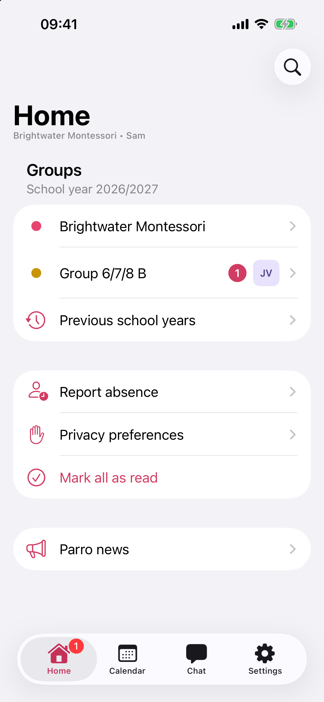 | 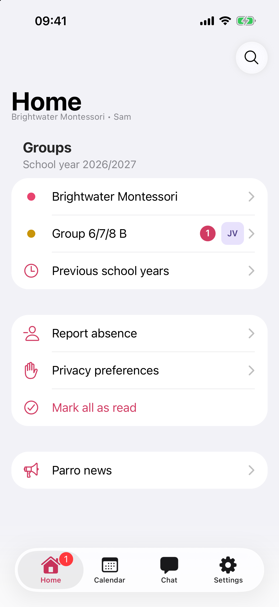 |

**The inner display in landscape: 946 × 669 and 958 × 669 pt** (round d2). Both show the tabs at the top and the list
beside the detail; `native-swift/` adds "Toggle sidebar".

| `native-swift/` | `ionic-capacitor` `matched` |
| --- | --- |
| 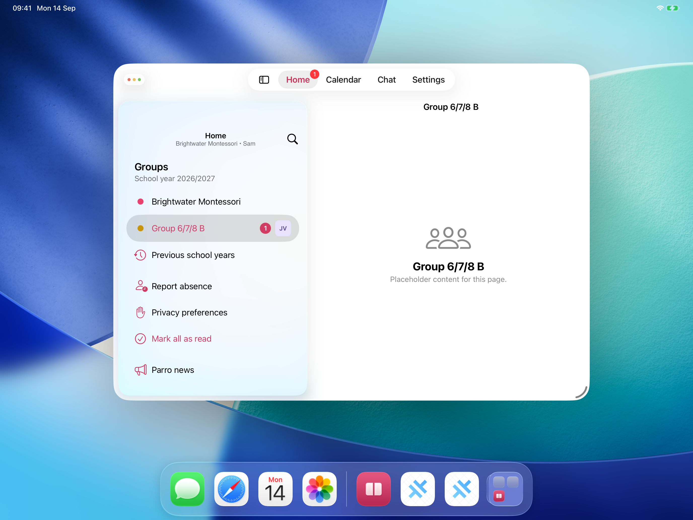 | 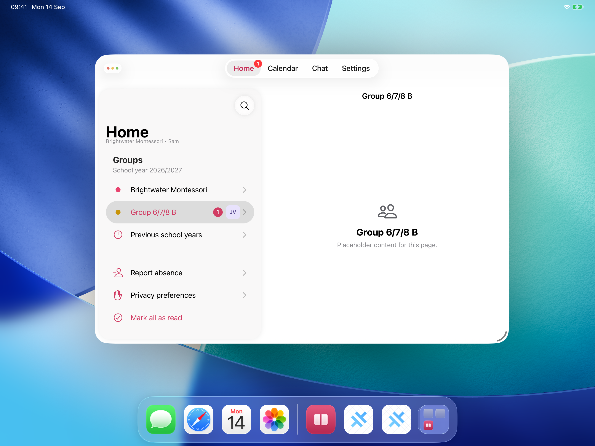 |
| 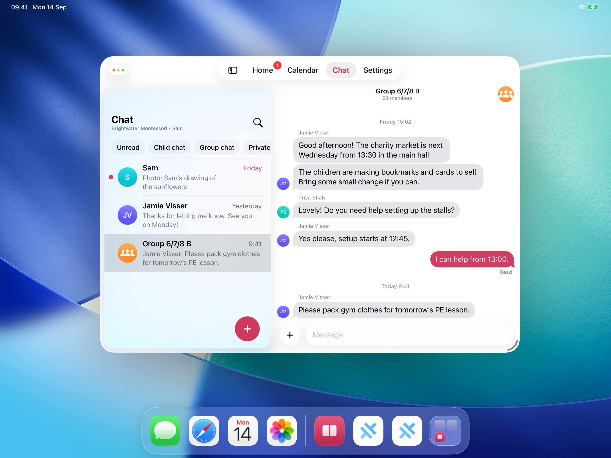 | 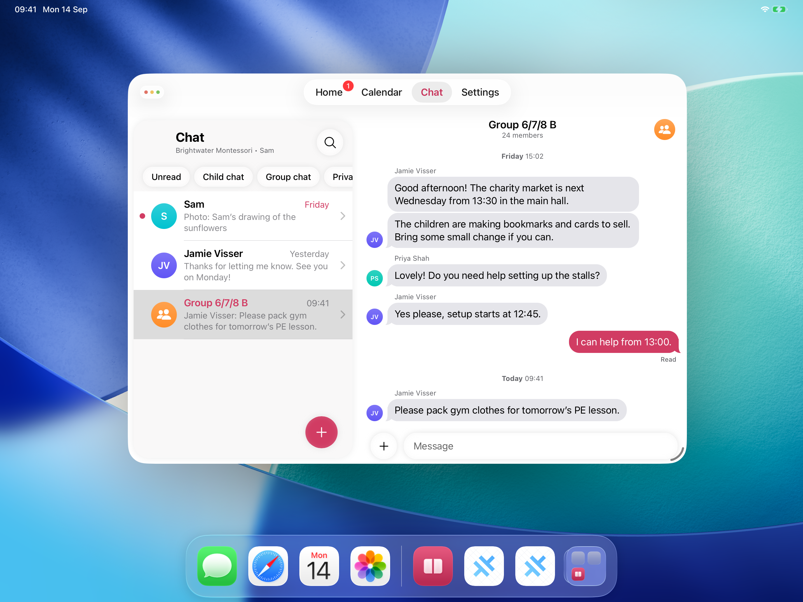 |

**One Split View half: 475 × 669 pt** (rounds d2 and d3). Top row, round d2, after narrowing from the inner display's
size with a Home row selected: no tab bar in `native-swift/`, the UIKit bar at the bottom in `matched`. Bottom row:
`native-swift/` launched into the window (d3) with the bar at the bottom; `matched`'s conversation (d2) with the bar
hidden and the back button after the window controls.

| `native-swift/` | `ionic-capacitor` `matched` |
| --- | --- |
|  | 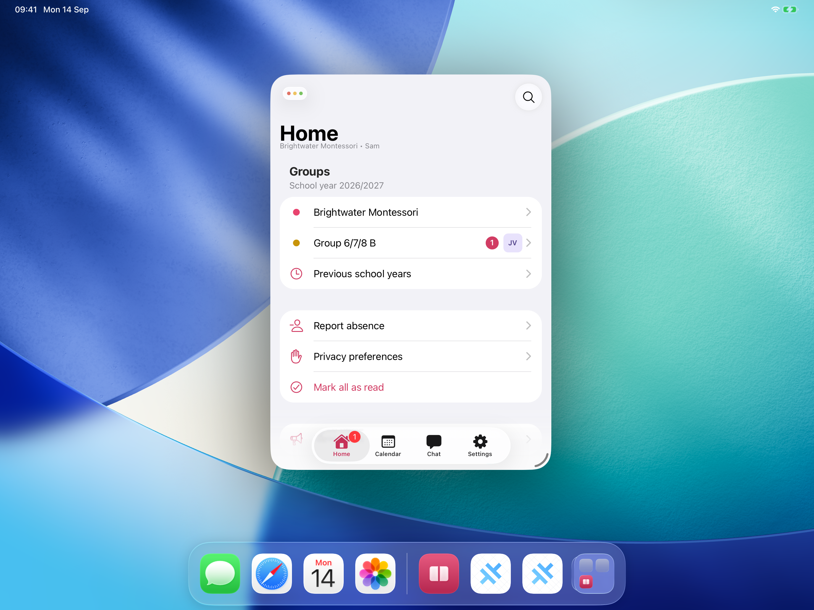 |
| 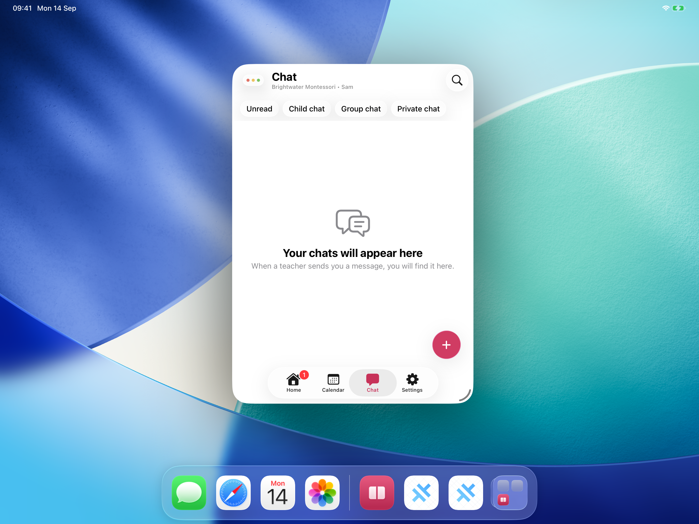 | 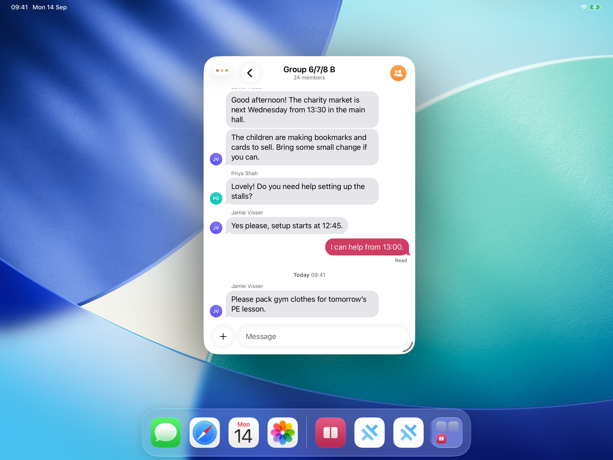 |

**The inner display in portrait: 674 × 958 pt, the narrowest window at that height** (round d2). Both regular width and
two columns; `matched`'s detail column is 279 pt and its title is cut. At 669 pt on iPhone Duo `matched` would show one
column (d5 above).

| `native-swift/` | `ionic-capacitor` `matched` |
| --- | --- |
| 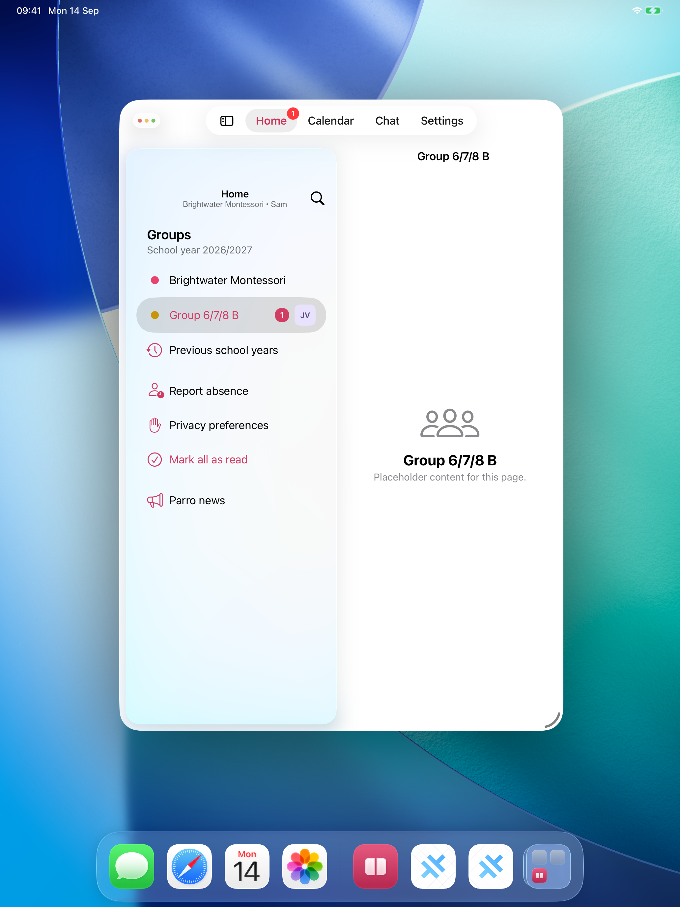 | 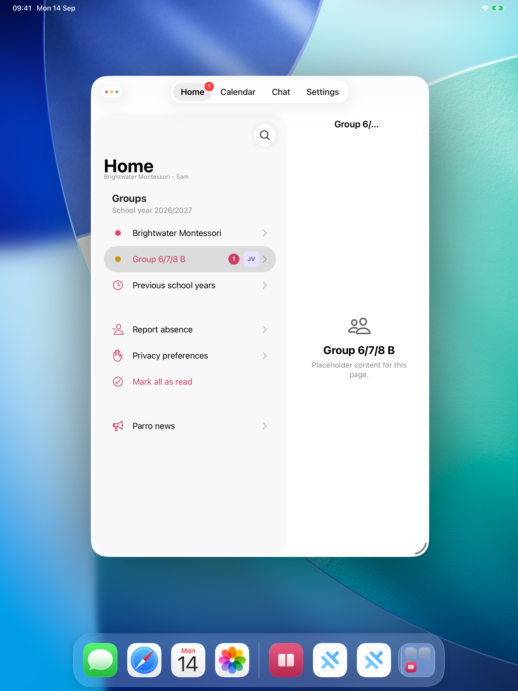 |

| folder | files | round | window | pixels |
| --- | --- | --- | --- | --- |
| `native-swift-ipadduoinner-v1` | `home-detail`, `chat-group` | d2 | 946 × 669 pt, landscape | 2752 × 2064 px |
| `ionic-capacitor-matched-ipadduoinner-v1` | `home-detail`, `chat-group` | d2 | 958 × 669 pt, landscape | 2752 × 2064 px |
| `native-swift-ipadduohalf-v1` | `home` (d2), `chat-empty` (d3) | d2, d3 | 475 × 669 pt, landscape | 2752 × 2064 px |
| `ionic-capacitor-matched-ipadduohalf-v1` | `home`, `chat-group` | d2 | 475 × 669 pt, landscape | 2752 × 2064 px |
| `native-swift-ipadduoportrait-v1` | `home-detail` | d2 | 674 × 958 pt, portrait | 2064 × 2752 px |
| `ionic-capacitor-matched-ipadduoportrait-v1` | `home-detail` | d2 | 674 × 958 pt, portrait | 2064 × 2752 px |

- Sizes in bytes (`stat -f %z`): `native-swift-ipadduoinner-v1` 6,302,806, `-ipadduohalf-v1` 8,291,459,
  `-ipadduoportrait-v1` 3,065,712; `ionic-capacitor-matched-ipadduoinner-v1` 6,126,833, `-ipadduohalf-v1` 8,389,546,
  `-ipadduoportrait-v1` 2,973,177; 35,149,533 bytes for 10 files, from 2,973,177 to 4,211,526 bytes each. `du -sk` over
  the same folders gave 36508 KiB right after the copies and 34344 KiB after the commit. The home screen's wallpaper
  around the window keeps each file at 3 to 4 MB; `-depth 8` with PNG compression level 9 made one file 2 % smaller,
  and the copies were left as `magick -auto-orient` wrote them. `shasum -a 256` over the 149 PNG files under
  `screenshots/`: no two equal.
- Rounds d1, d4 and d5 and the rest of d2 and d3 stay in `duo/shots/` in the session scratchpad.

### Tools and side effects

- `windowControl("Zoom-button")` printed "no Zoom-button" whenever the window was smaller than the screen: the driver
  taps the collapsed window controls at y 54 pt (`p4-driver/DriverUITests/Driver.swift:53`), and the windows of these
  tests started at y 126 or 151 pt. Each test after d1 started from the window the previous test left.
- A corner drag of 5 or 6 pt did not move the window (d2, d4); drags of 12 pt did (d5).
- `XCUIScreen.main.screenshot()` stores landscape screenshots as 2064 × 2752 px with orientation `LeftBottom`, as in
  phases 3 and 4.
- The iPad simulator is left in portrait with `dev.modaal.lab.tabshell.matched`'s window at 674 × 958 pt; both
  simulators keep their status bar override. No build was made and nothing under `ionic-capacitor/` or `native-swift/`
  changed; `git status --short` lists only the six new folders under `screenshots/` and this file.
- Session scratchpad: `p4-driver/DriverUITests/Duo.swift`, `Portrait.swift`, `duo-test.sh`, `duo-run.sh`, `duo-copy.sh`
  (not used: the copies were made with inline `magick` commands), `duo/` with logs, notes, trees and screenshots, and
  this entry's draft.

### What the rounds of this repository say for iPhone Duo

iPhone Duo reports the phone idiom (Swiftjective-C) and, on the inner display, regular width and height (talk 111461 at
2:46), with bars and insets on one side (Newsroom; talk 111462 at 0:28). The iPad rounds covered regular-width windows
and resizing; the iPhone rounds covered safe areas inside a native container. Items from both lists apply.

**From the iPad rounds (phases 3, 4 and 7 on `iPad Pro 13-inch (M5)`):**

1. **A width breakpoint gives a different layout from the size class on the inner display in portrait.**
   `ionic-capacitor/` shows columns from 672 px (`layout.ts:7`) because `native-swift/` changed size class between 666
   and 672 pt in an iPad window (spec 001 §18.2), and a CSS pixel is a point (§19.5). The inner display in portrait is
   669 pt wide by Apple's screenshot size, or 626 px by webmobilefirst; both are under 672, so the web build shows its
   phone layout there, while talk 111461 gives that display regular width. On the iPad both builds are compact at 669 pt
   (§18.2, §19.3), so iPad testing does not show this; rounds d4 and d5 could not make a 669 pt window 958 pt high.
2. **Ionic's menu breakpoint lies above the inner display's width in landscape.** `menuQuery` is 992 px (§19.1); 951 pt
   gives `ionic-capacitor/` two columns and a bottom tab bar, and `native-swift/` a top tab bar with "Toggle sidebar"
   (round d2). With the iOS 27.1 SDK the native bars move to the side (talk 111462 at 0:28).
3. **Folding and unfolding crosses 672 px each time,** from 466 pt on the outer display to 951 or 669 pt on the inner
   one. Each crossing mounts a new router outlet (`App.tsx:138`, §19.2), and state that is not in the path or in
   `ShellModel` starts again (§19.4): the draft needed `src/model/Drafts.tsx`, and scroll positions were not measured.
   `native-swift/` kept the selection and the draft across the same resize (§18.3).
4. **A comparison of the web view's size with `screen` misfires in Split View.** `watchWindowed()` (`layout.ts:47–55`)
   sets `windowed` while `innerWidth` differs from `screen.width` and `screen.height`, because iPadOS draws window
   controls over the web view and reports `env(safe-area-inset-left)` 0 (§19.5). A Split View half on iPhone Duo is
   narrower than the screen, so the class and `Columns.css`'s 72 px leading padding would apply; none of the sources
   above says whether iPhone Duo draws window controls. Talk 111461 at 4:16 tells native code to take the screen from
   the window scene.
5. **UIKit's containers adapt inside a Capacitor app.** In phase 7 at 816 pt the `UITabBarController` of
   `@capgo/capacitor-native-navigation` became the floating bar at the top without JavaScript for it (round n5), and it
   took the window's tint, which needed `AccentColor` in the App target (§20.2). Talk 111461 at 5:01 lists
   `UITabBarController` among the containers that adapt in every pose; talk 111462 at 2:39 says custom bars are not
   considered. `ion-tab-bar` and `ion-toolbar` are HTML in the web view and are not UIKit bars.

**From the iPhone rounds (passes 2a and 2b, phase 7 on `iPhone 16 (iOS 26.5)`):**

6. **CSS that computes offsets from a safe-area inset breaks when the inset's size changes.** The theme's
   `max(10px, safe-area − 12px)` plus fixed pixels assumed the 34 pt home indicator. Inside the tab controller the inset
   was 83 pt: "+" stood 49 pt too high and Settings ended 87 pt above the bar (rounds n2, n8), and 41 CSS lines replaced
   the arithmetic with the inset itself (§20.2, §20.4). On iPhone Duo the side with the bars, the status bar and the
   Dynamic Island takes an inset (Newsroom; talk 111461 at 6:06), and talk 111461 at 7:30 shows `left * 2` as the error
   to avoid. `matched` reads the left or right inset in three rules (`index.css:48–49`, `:777`) and the bottom inset on
   13 lines.
7. **A native container around the web view changes the web view's insets and colours.** The plugin moves the web view
   into the selected tab's controller and back when hidden (`NativeNavigationPlugin.swift:998–1015`, `:909–925`). The
   bottom inset went from 34 to 83 pt, and the keyboard's background from dark to light grey because the container takes
   the web view's opaque background (round q1, `:795–804`). `currentInsets()` (`:1959–1974`) reports the tab bar as a
   bottom height; a bar on the side has no term in it.
8. **UIKit bars match the native build; CSS bars do not.** The native bar matched `native-swift-v1`'s capsule, glyphs,
   label weight and badge (round n1); pass 2b's CSS bar differed in the glyphs and label weight, and SF Symbols and glass
   lensing are not available to web content (§15.6). On iPhone Duo UIKit lays out the vertical bars (talk 111462), with
   icon items vertical and text items horizontal (Crosley, quoting 7:06).
9. **The phone rules apply below 672 px.** `App.tsx:132` hides the native bar in a conversation below 672 px and from
   992 px. A Split View half (about 475 pt) and the outer display (466 pt) are compact and get those rules; the inner
   display in portrait gets them too (item 1).
10. **What a native bar cost.** Phase 7: 154 lines written by hand, no Swift, the first build 7 min 26 s after the start,
    142 tool calls in 33.2 minutes (§20.5).

### Strategy for a Capacitor app, before Xcode 27.1

Each step names the evidence above it rests on and how to check it on this machine before an iPhone Duo simulator
exists. Steps 1 to 8 need no iOS 27.1 SDK.

**In web code, now:**

1. **Choose the layout from the size class, not from the window width.** Send
   `traitCollection.horizontalSizeClass` and `verticalSizeClass` from native code to the web view as classes on the root
   element (for example `size-regular`, `size-compact`), updated from `registerForTraitChanges`, and key the columns and
   the tab placement to them; keep a width media query only for a browser. Evidence: items 1 and 9; talk 111466 at 3:42.
   Check: log the class the web view receives in the iPad window steps of §18.2 (regular at 672 pt, compact at
   666 pt), then in the iPhone Duo simulator's inner display in portrait (step 9).
2. **Keep navigation state out of components that remount at a layout change.** Keep the route, each tab's selection,
   drafts and scroll offsets in the URL or a store, and do not key the router outlet to the layout (`App.tsx:138`), or
   restore state after it remounts. Evidence: item 3. Check: phase 4's `testState` across 672 pt with a scrolled list.
3. **Use each safe-area inset as the space it takes, per side.** Remove arithmetic that assumes an inset's size, such as
   `max(10px, safe-area − 12px)`, and give leading and trailing content `env(safe-area-inset-left)` and `-right` on their
   own. Evidence: item 6; talk 111461 at 6:06 and 7:30. Check: `grep -rn 'safe-area' src` and read each expression.
4. **Remove heuristics that compare the web view with `screen`.** `watchWindowed()` is one (`layout.ts:47–55`). Evidence:
   item 4. Check: in a 475 pt window the leading bar content starts after the window controls on the iPad (round d2,
   `ionic-capacitor-matched-ipadduohalf-v1/chat-group.png`), and in the iPhone Duo simulator's Split View it must not
   move unless iPhone Duo draws such controls.
5. **Do not depend on fold state in the web view.** No web API reports it: `WebKit.framework/Headers` of the iOS 27.0 SDK
   has no fold or segment symbol, Viewport Segments is Chromium-only with WebKit's standards position open (#327), and
   the Safari 27 sources above list nothing. Lists and feeds do not need it (talk 111463).

**In native code, now (Xcode 26.6 or 27.0):**

6. **Let UIKit own the tab bar.** Draw it with a `UITabBarController`, as phase 7 does with
   `@capgo/capacitor-native-navigation` 8.3.1, and set the accent colour at app level (`AccentColor` and
   `ASSETCATALOG_COMPILER_GLOBAL_ACCENT_COLOR_NAME`). Talk 111462 at 2:00 and 2:39: only bars of navigation containers
   take the side placement. Evidence: items 5, 7, 8. Cost: item 10. The iOS 27.1 behaviour of this plugin's controller is
   not known (step 10).
7. **Keep the UIScene lifecycle and one scene.** Capacitor 8.5.2's template has `SceneDelegate` and
   `UIApplicationSupportsMultipleScenes` false (`Info.plist:27–45`); talk 111464 at 2:59 says all apps take part in
   Split View. A second window is a second `CAPBridgeViewController` and web view; enable multiple scenes only after
   testing plugins with two bridges.
8. **Test in iPad windows of iPhone Duo's sizes.** On `iPad Pro 13-inch (M5)`: 951 × 669 pt in landscape (the inner
   display), about 475 × 669 pt (a Split View half; the divider's width is not published), 669 × 951 pt in portrait, and
   466 × 678 pt (the outer display). Round d2's `testDuo` resizes the window by its corner; at a height of 958 pt the
   window stops at 674 pt wide (d5). Test each size both after launching into it and after resizing into it with a row
   selected: `native-swift/` showed its tab bar at 475 × 669 pt in the first case and none in the second (d2, d3). The
   iPad does not reproduce the side bars, the fold, the phone idiom, or regular width below 672 pt.

**When Xcode 27.1 beta ships:**

9. **Build with the iOS 27.1 SDK and run the iPhone Duo simulator in Device Hub** (talk 111461). Read, in each pose and
   in Split View: `innerWidth` and `innerHeight`, the four `env(safe-area-inset-*)` values, the plugin's
   `--cap-native-navigation-*` values, and where the tab bar is drawn.
10. **Check the plugin's `UITabBarController` with vertical bars.** If the bar goes to the side, the web view needs the
    side inset and `currentInsets()` (`:1959–1974`) needs a term for it; if it stays at the bottom, the plugin is where
    the change goes. HTML headers (`ion-toolbar`) stay horizontal; where they collide with the side region,
    `preferredVerticalBarBehavior` on the bridge view controller keeps UIKit's bars horizontal (talk 111462 at 14:47).
11. **Bridge reserved regions only for controls near the fold.** `UIViewReservedRegion` (iOS 27.1) with `.division` and
    `.occlusion`, sent as CSS variables and an event the way `updateInsetsAndNotify()` sends insets (`:1980–2006`), in the
    shape proposed in cordova-ios#1720 and flutter#192515. A scrolling list does not need it.
12. **Spec 001 phase 5** measures steps 9 to 11 on both builds.

| iPhone Duo behaviour | `native-swift/` at `63b55e9` | `ionic-capacitor` `matched` at `63b55e9` | route for a Capacitor app |
| --- | --- | --- | --- |
| layout by size class on the inner display | `NavigationSplitView` and `TabView(.sidebarAdaptable)` switch by size class (§18) | columns by `(min-width: 672px)`, menu by 992 px (§19) | step 1 |
| Split View half, compact | one column, detail pushed (round d2) | one column below 672 px (round d2) | already follows width; step 4 |
| state across fold and unfold | kept across a resize (§18.3) | kept for path, selection and drafts; component state restarts (§19.4) | step 2 |
| bars on the side (iOS 27.1 SDK) | `TabView` and navigation bars are system bars | the tab bar is a `UITabBarController`; headers are `ion-toolbar` | steps 6, 9, 10 |
| asymmetric insets | SwiftUI safe areas | `env()` per side in 3 rules, bottom arithmetic removed in phase 7 | step 3 |
| fold region | `ReservedRegion`, iOS 27.1 | no web API | steps 5, 11 |

## 2026-09-14 — Screenshot index pages, one per device

From the user, after `0756c07`:

> Please create screenshots/index-<platform>.html page that lists every surface the screenshot is available for as a row
> in table.
> Platform is ipad, ipad-narrow, ipad-horizontal, iphone etc.
> If you can do a procedural thing (eg create .xml files with an XML styleshteet to render the styled page, or any other
> simialr way - a JS SPA web page - to share the styling across multiple data files).
> Rows should list the native iPhone/iPad reference on the left, and the Capacitor variant on the right, as two columns.
> Each table should have a switch that allows to toggle between side-by-side and a splitview where you can drag a
> vertical divider line between two halves, revealing one or another in a single view.

Spec 001 §17.5 lists the files and what the pages show.

**Sources**

| source | fetched or search only | taken from it |
| --- | --- | --- |
| https://developer.chrome.com/docs/web-platform/deprecating-xslt, "Removing XSLT for a more secure browser" | fetched, through a summarizing fetch | published 2025-10-29; "Chrome 143 (Dec 2, 2025): Official deprecation of the API"; "Chrome 158 (Nov 17, 2026): XSLT stops functioning on Stable releases"; the summary found nothing on `file://` pages |
| spec 001 §17.1, §17.2, §18.5, §19.1, §19.6, §20.6; this file's entry "iPhone Duo: what a Capacitor app can adopt before the device ships" | read in the repository | the folder name parts, how the versions of a prefix combine, and the window setup, round and window size written into each page's description |

**Decisions**

- **HTML pages that load shared files, in place of XML with an XSLT stylesheet.** Chrome 158 stops XSLT on Stable on
  2026-11-17 (source above). Each `index-<device>.html` holds its device value and description, and loads `viewer.css`,
  `manifest.js` and `viewer.js` with `<link>` and `<script src>`. Loading a data file with `fetch()` was not tried.
- **Page names use the §17.1 `device` values:** `index-ipadnarrow.html` and `index-ipadlandscape.html` for the request's
  "ipad-narrow" and "ipad-horizontal", `index-iphone.html` for the folders without a device part, and one page each for
  `ipad`, `ipadmedium`, `ipadduoinner`, `ipadduohalf` and `ipadduoportrait`.
- **The right column is a chosen `ionic-capacitor` folder or prefix, `matched` by default;** `stock` and each version
  are in the list. A prefix takes each screen from its highest version that has it (§17.2):
  `ionic-capacitor-matched-ipadnarrow` shows `home-detail` from `-v2`.
- **`index-ipadmedium.html` starts its left column at `native-swift-ipad`,** since `native-swift` has no `ipadmedium`
  folder (§19.6). Round n5 in this file compared the same pair.
- **Rows are file names, so different states take separate rows:** `native-swift-ipadnarrow-v1/chat-group-draft` and
  `ionic-capacitor-*-ipadnarrow-*/chat-group-sent`; `native-swift-ipadduohalf-v1/chat-empty` and
  `ionic-capacitor-matched-ipadduohalf-v1/chat-group`. The side without the file shows "No <name>.png in <folder>".
- **Images use `loading="lazy"`,** so a page requests the images near the viewport first.

**Checks** (working tree on top of `0756c07`; Darwin 25.6.0; `/bin/bash` 3.2.57; Node 20.19.5; Firefox 155.0.1)

- **`build-index.sh`, first run under `/bin/bash` 3.2.57:** `node` failed to load `manifest.js` with "SyntaxError:
  Unexpected identifier 'ionic'". `quote_list` wrote `["native-swift "ionic-capacitor"]`, and `od -An -tu1 -j16 -N8`
  printed a second, empty line, for which `awk` printed another `0,0`: `[2064,27520,0]`. Fixed with a loop that quotes
  each value and `awk 'NF { … }'`.
- **Second run:** `node` loads `manifest.js` with 25 folders and 149 PNG files, the count
  `find screenshots -name '*.png' | wc -l` gives; the sizes are 2064 × 2752, 2752 × 2064 and 1179 × 2556 px.
  `node --check screenshots/viewer.js` passes. The eight pages the first run created with a placeholder description were
  deleted and written again with their descriptions.
- **Firefox 155.0.1 `--headless --no-remote --profile <new profile in the session scratchpad> --screenshot`, from
  `file://`:**
  - `index-ipadnarrow.html` at 1400 × 1800: the device links, the description, the toolbar with "Left
    native-swift-ipadnarrow-v1", "Right ionic-capacitor-matched-ipadnarrow, v2 then v1" and "4 screens", and the
    placeholder "No calendar-event.png in ionic-capacitor-matched-ipadnarrow, v2 then v1". The image cells showed alt
    text and no image. The same in `index-ipadmedium.html?mode=split` at 1400 × 1800 and `index-iphone.html?mode=split`
    at 420 × 1800. `user_pref("dom.image-lazy-loading.enabled", false)` in the profile's `user.js` did not change it.
  - `eager.html` in the session scratchpad, which loads the same files through `<base href>` and sets every
    `img.loading` to `eager` after `viewer.js` runs: the screenshots drew for `iphone` at 420 × 1800, with the screen
    name above two columns, and for `ipadduohalf` at 1400 × 1800, with 3 rows, two of them with a placeholder.
  - `harness.html` in the session scratchpad, `ipadmedium` in split view, with `setPointerCapture` and
    `hasPointerCapture` stubbed because synthetic pointer events have no active pointer: 10 `keydown` ArrowLeft on the
    first divider set `--pos` to 30% and `aria-valuetext` to "30% native-swift-ipad-v1"; `pointerdown` at 80% of the
    second split's width and `pointermove` at 90% set it to 90%. The screenshot showed `native-swift-ipad-v1` left of the
    divider and `ionic-capacitor-matched-ipadmedium-v2` right of it.
  - Not tested: the pages in a browser window, and dragging with a real mouse, pen or touch.
- **Side effects:** a Firefox profile in the session scratchpad; the default Firefox profile was not used.

## 2026-09-16 — Audit for what a public reader cannot resolve, and LICENSE, SECURITY.md, CONTRIBUTING.md

- **Question asked:** "check the repo for hermecity - it shouldn't mention other private repos,
  contain paths to local files, or reference documents outside of this repo", and add LICENSE (MIT),
  SECURITY and CONTRIBUTING, with the repository public but frozen: "this repo will be public, but
  frozen, no public contributions are accepted. Issues and discussions can be opened, but answers
  are not guaranteed."
- **Machine-specific paths in committed files**, from
  `git ls-files -z | xargs -0 grep -InE '(/Users/|/Volumes/|/private/tmp/|/home/[a-z]|file:///)'`:
  - `DISCOVERY.md:47`, `:114`, `:1133` and `specs/001-four-tab-shells/spec.md:97`, `:98`, `:557`,
    `:606` gave the two Xcode bundles by their full path, naming a volume and a directory on this
    machine.
  - `DISCOVERY.md:127` gave a Node binary by a path starting with this machine's account directory.
  - `DISCOVERY.md:509` gave a session transcript by a path holding the absolute path of this working
    copy and a session UUID.
  - Resolvable for any reader and left alone: `/Library/Developer/CoreSimulator/Profiles/DeviceTypes`
    (`DISCOVERY.md:120`, `spec.md:614`), `~/.npm` (`:317`), `~/.ionic/config.json` (`:344`, `:407`).
- **References to documents that are not in the repository:**
  - "the session scratchpad": 35 lines in `DISCOVERY.md`, 7 in `spec.md`, naming 24 scripts —
    `imgdiff.swift`, `p4-measure.sh`, `p4-iphone.sh`, `p4-orient.py`, `p7-measure.sh`, `p7-test.sh`,
    `p7-copy.sh`, `p7-effort.py`, `shoot-matched.sh`, `shoot-ionic.sh` and others. `spec.md:2061`
    states of the XCUITest driver: "session scratchpad, not committed". These carry the "how it was
    taken" column of most measurements in spec 001 §§15–20.
  - The session transcript, cited as the source of tool-call counts and active time:
    `spec.md:147`, `:1708`, `:1710`, `:1753`, `:1755`, `:2429`; `DISCOVERY.md:509`, `:521`, `:1092`.
  - `modaal-agent-skills` (`DISCOVERY.md:12`), as the repository README.md, AGENTS.md, `.gitignore`
    and `ci.yml` were adapted from. `gh api repos/modaal-agent/modaal-agent-skills` returns 404 and
    `gh api "search/repositories?q=modaal-agent-skills"` returns `total_count` 0; the public
    repository with that content is `modaal-agent/skills`.
- **`modaal-agent/duet-tutorials` at `511b22b` resolves**: `gh api repos/modaal-agent/duet-tutorials
  --jq .visibility` returns `public`, and `gh api
  "repos/modaal-agent/duet-tutorials/contents/tutorial3-start/src-ios/App?ref=511b22b"` lists
  `Foyer` and `xcodegen.yml`, the paths cited in spec 001 §1.7. No change needed there.
- **No leak of the names in `_assets/` into any text file.** A case-insensitive `grep -Iil` over the
  tracked files for the distinctive word of the school name matches only the invented
  "Brightwater Montessori" in
  `ionic-capacitor/src/fixtures/fixture.ts:79`, `native-swift/TabShell/Fixtures/Fixture.swift:88`,
  `:90` and `spec.md:693`, `:740`. The word-boundary matches for the child's first name are all the
  UI label "Mark all as read". No email address, no `DEVELOPMENT_TEAM`, no token: `grep` for
  `[A-Za-z0-9._%+-]+@[A-Za-z0-9.-]+\.[A-Za-z]{2,}` over the tracked files gives only
  `AppIcon-512@2x.png`, `git@github.com` in `package-lock.json` and `hello@cypress.io`.
- **All four images in `_assets/` still carry the real school name and the child's first name**, in
  the header of each screen: `IMG_0210.PNG` also in the Groups list, `IMG_0211.PNG`, `IMG_0212.PNG`
  and `IMG_0213.PNG` in the subtitle line. Read with the Read tool. This repeats what the entry
  "2026-09-13 — Repository seeded (`d8c8f44`)" recorded and it is still unfixed; the images hold no
  message text, address, email or full name.
- **Every relative Markdown link in `README.md`, `AGENTS.md`, `DISCOVERY.md` and `spec.md`
  resolves**, checked by extracting each `](path)` and testing it with `[ -e ]`.
- **Neither build opens a network connection.** `grep -rInE '\b(fetch\(|XMLHttpRequest|URLSession|WKWebView\(|axios|WebSocket)\b'`
  over `ionic-capacitor/src` and `native-swift/TabShell` matches nothing at `168575f`. This is the
  claim SECURITY.md §"What is here, for the purpose of a report" makes.
- **Sources read:**

  | source | how | taken from it |
  | --- | --- | --- |
  | `modaal-agent/skills`, `LICENSE`, `SECURITY.md`, `CONTRIBUTING.md`, `AGENTS.md` | fetched with `gh api repos/modaal-agent/skills/contents/<file>` | the MIT text and its `Copyright (c) 2026 Modaal.dev` line; the private-reporting wording; the §"Public-facing text is hermetic" rule this audit was run against |
  | `modaal-agent/duet-tutorials` at `511b22b` | fetched with `gh api` | that the paths spec 001 §1.7 cites exist and are public |

- **Written:** `LICENSE` (MIT, `Copyright (c) 2026 Modaal.dev`, matching `modaal-agent/skills` and
  the `dev.modaal.lab.tabshell` bundle identifiers), `SECURITY.md` and `CONTRIBUTING.md`.
  `README.md` takes three rows in its Layout table and two lines under §"Working in this
  repository".
- **Answers.** Asked which of the above to redact, given that `AGENTS.md` §"DISCOVERY.md is an
  append-only log" forbids editing an existing entry "not to fix a typo or a path" and §"Specs are a
  decision record" allows a closed spec only additions: "Redact machine-specific paths only" — the
  session-scratchpad and transcript citations stay, because they carry how each measurement was
  taken. Asked what to do about the two names in the four `_assets/` images before the repository is
  public: "Leave them".
- **The redaction, made under the one-time exception those answers grant**, in place in both files:
  - The seven Xcode bundle paths now read `<xcode-installs>/` in place of the directory holding the
    two bundles. The bundle names `Xcode_26_6.app`, `7882741C-…/Xcode.app` and `Xcode_27_RC.app` are
    unchanged, so the finding that the second install moved and `mdfind` stopped resolving the old
    path still reads. Spec 001 §1.3 takes an addition saying the same.
  - `DISCOVERY.md:127` now reads `~/.nvm/versions/node/v20.19.5/bin/node`.
  - `DISCOVERY.md:509` now names its source "the session transcript, this session's JSONL file under
    `~/.claude/projects/`", without the working copy's absolute path or the session UUID.
  - `git ls-files -z | xargs -0 grep -InE '(/Users/[a-z]|/Volumes/[A-Z]|/private/tmp/|file:///)'`
    over the tracked files now matches only the grep pattern quoted in this entry.

## 2026-09-16 — `_assets/` removed from the tree and the history

- **Question answered again.** The entry above records "Leave them" for the two names in the four
  `_assets/` images. That was replaced within the same turn: "Please also remove _assets (redact the
  history)". This entry supersedes that answer.
- **What was removed:** `_assets/IMG_0210.PNG`, `IMG_0211.PNG`, `IMG_0212.PNG` and `IMG_0213.PNG`,
  with `git rm -r _assets`. Each showed a real school name and a real child's first name in its
  screen header, and `IMG_0210.PNG` also in its Groups list.
- **`git log --oneline --all -- _assets` gives one commit**, `d8c8f44`, the root commit, which is
  where the four files entered the history. 18 commits in `git rev-list --all --count`.
- **The remote already holds them.** `git remote -v` gives
  `git@github.com:modaal-agent/lab-replicate-parro-crossplatform.git`, `git ls-remote origin` gives
  `168575f` for `HEAD` and `refs/heads/main` — the same commit as local `HEAD` — and
  `gh repo view --json visibility,isPrivate,pushedAt` gives `PRIVATE`, `isPrivate` true, pushed
  2026-09-14T20:48:08Z. A rewrite plus a force-push does not delete the four blobs from GitHub: they
  stay reachable there by commit and blob SHA until GitHub garbage-collects, which a repository
  owner cannot trigger.
- **`git-filter-repo` is not installed** (`command -v git-filter-repo` gives nothing). `brew` and
  `pip3` are on the machine; `pipx` is not.
- **References rewritten so that none of them is a path any more.** The four file names stay in this
  file and in the spec as the names of the four screens, defined in spec 001 §1.2:
  - `specs/001-four-tab-shells/spec.md`: the four Markdown links in §1.2 became plain names; §1.2
    took an `Added 2026-09-16` note; §1.1's list of what `d8c8f44` tracks names the screenshots as
    removed; 18 further mentions of `` `_assets/` `` became "the reference screenshots" or
    "reference (§1.2)".
  - `AGENTS.md` and `CLAUDE.md`: the "what a screen looks like" row now points at spec 001 §1.2;
    §"Two builds of one shell"'s placeholder-data rule no longer names a file that showed the real
    names; §"What goes in which document"'s `_assets/` entry became the rule that a screenshot of
    someone's real account is not committed. `cmp AGENTS.md CLAUDE.md` passes.
  - `README.md`: the `_assets/` row is gone from the Layout table, and the `LICENSE` row no longer
    carves it out.
  - `ionic-capacitor/src/fixtures/fixture.ts:6` and
    `native-swift/TabShell/Fixtures/Fixture.swift:86` point at spec 001 §1.2 instead of the files.
- **Not yet done at the time of this entry:** the commit, the history rewrite and what happens to
  the remote.

## 2026-09-19 — iPhone Duo simulator: both builds on the inner display

From the user, on `168575f`: "Now that iPhone Duo is out and installed locally and ready for testing, please build and
run the current "matched" style Capacitor app, and compare it to the native swift app - on iPhone Duo simulator. Capture
screenshots (in the new device class folders). Then find a way to make the look and feel of the Capacitor app match the
default style of the SwiftUI app on iPhone Duo. Record the full discovery/implementation/iteration path for subsequent
analysis/reciting. Commit logical steps autonomously."

Spec 001 §21 holds the plan and results that follow from this entry. Round names: r on the iPhone Duo simulator with the
XCUITest driver, p for the probe build, a and h for the console-captured runs, i for the iPad on iOS 27.0.

### Machine state, read at 03:24–03:27

The machine differs from spec 001 §10.5, §10.6 and the entry "iPhone Duo: what a Capacitor app can adopt before the
device ships" of 2026-09-14:

| item | before | now | read with |
| --- | --- | --- | --- |
| selected Xcode | 26.6 (17F113), `/Volumes/DATA01/DISTR/Xcode/Xcode_26_6.app` | 27.1 beta (27A9269), `/Applications/Xcode_27_1_beta.app`, iOS 27.1 SDK only | `xcode-select -p`, `xcodebuild -version`, `xcodebuild -showsdks` |
| other Xcode | 27.0 RC at `/Volumes/DATA01/DISTR/Xcode/Xcode_27_RC.app` | 26.5 (17F42) at `/Applications/Xcode_26_5.app`; `/Volumes/DATA01/DISTR/Xcode/` does not exist | `mdfind "kMDItemCFBundleIdentifier == 'com.apple.dt.Xcode'"`, `ls` |
| simulator runtimes | iOS 18.6, 26.5 (23F77), 27.0 (24A434) | iOS 27.0 (24A434), iOS 27.1 (24A94401); devices of other runtimes are listed as unavailable | `xcrun simctl list runtimes`, `list devices -j` |
| simulators of earlier phases | `iPhone 16 (iOS 26.5)` `70D15E5B-…`, `iPad Pro 13-inch (M5)` `7A47789D-…` | neither UDID is listed | `xcrun simctl list devices -j` |
| iPhone Duo | no device type | device type `com.apple.CoreSimulator.SimDeviceType.iPhone-Duo`; `iPhone Duo` `2BA513E7-59CC-4754-A9F7-E73F027D9619` (booted) and `1CBE1FEE-0E61-4FCE-928D-B0CDA06561D0` (shut down), iOS 27.1 | `xcrun simctl list devicetypes`, `list devices` |
| Swift | 6.3.3 | 6.4 (swiftlang-6.4.0.34.1) | `swift --version` |
| XcodeGen | 2.45.4 | 2.44.1, `/opt/homebrew/bin/xcodegen` | `xcodegen --version` |
| Node, npm | 24.21.0 and 20.19.5 under nvm | 22.22.3 (default) and 21.1.0 under nvm; npm 11.15.0 | `node --version`, `ls ~/.nvm/versions/node` |
| AXe | 1.7.1 in `xcodebuildmcp` | not on `PATH` | `which axe idb` |
| ImageMagick | 7.1.2-31 | 7.1.2-15 | `magick -version` |
| macOS, host | 26.6.2 (25G83) | 26.6.2 (25G83); Apple M1 Max, 64 GB | `sw_vers`, `sysctl` |

Node 22.22.3 meets Capacitor 8's "Node 22 or greater" (spec 001 §1.3); this entry's builds use it.

### The iPhone Duo simulator

- **Device type** (`/Library/Developer/CoreSimulator/Profiles/DeviceTypes/iPhone Duo.simdevicetype`, `profile.plist`):
  model `iPhone19,4`, product class `V68`, `minRuntimeVersion` 27.1, product family 1 (iPhone),
  `com.apple.CoreSimulator.display.resizableScene`. `capabilities.plist` lists two integrated displays at scale 3: `LCD`
  1398 × 2034 px (466 × 678 pt) and `LCD-1` 2007 × 2853 px (669 × 951 pt).
- **`xcrun simctl io 2BA513E7-… enumerate`:** screen 1 `LCD` (device name `primary`) and screen 3 `LCD-1`
  (`primary-1`), both "UI Orientation: Landscape Left", plus `TVOut`, `Wireless` (CarPlay) and `Resizable` 7680 × 4320.
- **As booted:** `simctl io … screenshot --display=3` gives the inner display, 2853 × 2007 px, the home screen in
  landscape with the time and Wi-Fi in a column at the top trailing corner; `--display=1` gives a black 2034 × 1398 px
  frame. So the device is open, with the inner display in landscape.
- **Another app, "Vibereef", is installed on this simulator;** it was not opened.
- **No command changes the pose.** `xcrun simctl help` lists no pose, fold or display-mode subcommand; `simctl ui` sets
  appearance, contrast and content size only. Xcode 27.1's simulator window is `DeviceHub.app`
  (`com.apple.dt.Devices` 27.1, `Contents/Applications/DeviceHub.app`), running. Its only URL scheme is `devices`, and
  `strings` on its binary and on `DeviceKit.framework` finds no pose, hinge or fold command. `osascript` against
  `System Events` fails with "osascript is not allowed assistive access" (-1728, -1719), so its buttons cannot be
  pressed from a script without a permission the user grants in System Settings. `strings` on the iOS 27.1 runtime's
  `SpringBoard.framework` finds hinge code, `SBHingeMotionDetectionSettings` and "SBDisplayToolService: Insufficient
  authorization to replay hinge samples for client", which was not pursued.
- **XCTest has no pose API.** `XCUIAutomation.framework/Headers/XCUIDevice.h` in the 27.1 SDK declares `orientation`,
  `appearance`, `pressButton:`, `location` and iOS 27.0's `voiceOverService`. Round r3 set
  `XCUIDevice.shared.orientation = .portrait` before launching each app: the driver read orientation 1 afterwards, and
  both apps kept a 951 × 669 pt window, landscape, in every screenshot. Talk 111461 at 2:46 says the inner display does
  not honour supported interface orientations.
- **Poses covered:** the inner display in landscape only. The inner display in portrait, the closed device (outer
  display), the folded poses and Split View need DeviceHub's controls pressed by hand and were not taken.

### iOS 27.1 SDK headers

Read in `Xcode_27_1_beta.app/…/iPhoneOS.sdk`:

- `UIKit.framework/Headers/UIViewReservedRegion.h`: `UIViewReservedRegion` (`identifier`, `kind`, `frame`, `margins`,
  `active`), kinds `occlusionRegionKind` and `divisionRegionKind`, `UIViewReservedRegionQueryOptionsIncludeInactive`;
  `UIView.h:760–763` `reservedRegionsOfKind:` and `reservedRegionsOfKind:options:`. All `API_AVAILABLE(ios(27.1))`.
- `UIVerticalBarEdge.h`: `UIVerticalBarEdge` `Unspecified`, `Leading`, `Trailing`, read from
  `UITraitCollection.verticalBarEdge`, iOS 27.1.
- `UINavigationItem.h:68–82`, `:312`: `UIVerticalBarCompressionBehavior` (`Automatic`, `PrefersBarItems`,
  `PrefersTabBar`) and `verticalBarCompressionBehavior`. `UIViewController.h:807–858`: `UIVerticalBarBehavior`
  (`Automatic`, `Disabled`), `preferredVerticalBarBehavior`, `childViewControllerForPreferredVerticalBarBehavior`,
  `setNeedsUpdateOfVerticalBarConfiguration`.
- `grep -rn -i -E 'segment|fold|posture|reservedRegion|division'` over `WebKit.framework/Headers`, leaving out
  "segmented": no match.

### Builds, Xcode 27.1 beta, working tree on `168575f`

- `npm ci` in `ionic-capacitor/` under Node 22.22.3: 36.36 s real, exit 0, "10 vulnerabilities (8 moderate, 2 high)";
  `npm ls --depth=0` lists the versions of spec 001 §20.3 (`@capacitor/*` 8.5.2, `@ionic/react` 9.0.3,
  `@rdlabo/ionic-theme-ios26` 9.2.0, `@capgo/capacitor-native-navigation` 8.3.1, Vite 8.3.0, TypeScript 5.9.3).
- `native-swift/`: `xcodegen generate` (2.44.1), then `xcodebuild … -destination 'platform=iOS Simulator,id=2BA513E7-…'`
  with a new `-derivedDataPath`: 11.29 s real, "BUILD SUCCEEDED", one `warning:` line, from
  `appintentsmetadataprocessor`. No source change.
- `matched`: `npm run build:matched` 7.99 s real; `npx cap copy ios` 0.75 s; `xcodebuild …
  PRODUCT_BUNDLE_IDENTIFIER=dev.modaal.lab.tabshell.matched build` 15.95 s. Warnings that spec 001 §20.3 did not list
  with Xcode 26.6: three at `node_modules/@capacitor/keyboard/ios/Sources/KeyboardPlugin/Keyboard.m:50:17` ("auto
  property synthesis will not synthesize property 'identifier' / 'jsName' / 'pluginMethods' declared in protocol
  'CAPBridgedPlugin'") and one at `NativeNavigationPlugin.swift:271:47` ("'weak' ownership of capture 'self' differs
  from implicitly-captured strong reference in outer scope").
- `xcrun simctl status_bar 2BA513E7-… override --time 9:41 --batteryState charged --batteryLevel 100 --cellularBars 4
  --wifiBars 3`, then install and launch. Both apps open full screen on the inner display, 951 × 669 pt.

### The driver

An XcodeGen project in the session scratchpad, `driver/` (not committed): a host app and a UI test bundle that drives an
app by bundle identifier, as in phases 3 and 4. `tour.sh <bundle> <dir> <prefix> <test>` runs one test through
`xcodebuild test -only-testing:` with `TEST_RUNNER_DRV_*` variables and `-collect-test-diagnostics never`.

- **`XCUIScreen.main` is the outer display.** Round r1's first screenshot through it was 1398 × 2034 px, orientation
  `RightTop`, and black. `XCUIScreen.screens` gave two screens, 678 × 466 and 950 × 668 pt; the lit one's PNG was 2006 ×
  2852 px, `RightTop`, one pixel short of the display on each side.
- **Screenshots are therefore taken on the host:** the test writes `<name>.req` and waits; `shot-watch.sh` answers with
  `xcrun simctl io 2BA513E7-… screenshot --display=3 <name>.png`, upright at 2853 × 2007 px, orientation `Undefined`.
  The test falls back to the largest `XCUIScreen.screens` PNG after 15 s; no screenshot of this entry used it.
- **Tabs:** SwiftUI's and the plugin's tab bars expose buttons "Home", "Calendar", "Chat", "Settings"; `app.tabBars` is
  empty in both apps. Rows are `Button` or `Cell` elements in `native-swift/` and `Link` or `StaticText` in `matched`,
  found by label prefix.

### Round r2: the two builds side by side

`testTour` on each app: `home`, the "Group 6/7/8 B" row (`home-detail`), Calendar, the "Charity market" card
(`calendar-event`), Chat (`chat-empty`), three taps on "New chat" (`chat-list`), the "Group 6/7/8 B" chat (`chat-group`),
Settings, the "Notifications" row (`settings-detail`). `native-swift/` at 03:32:46. `matched`'s first run (03:33) and
its run in round r3 (03:37) stopped at the Settings step with "Failed to get matching snapshot", where the driver read
the tapped button's frame for its note; the driver was changed to read the frame before the tap, and `matched` ran again
at 03:40:47. Frames from `app.debugDescription` in points; the screenshots are in
`screenshots/native-swift-duoinner-v1/` and `ionic-capacitor-matched-duoinner-v1/`.

- **The tab bar is the same in both.** SwiftUI's `TabView` with `.sidebarAdaptable` and the plugin's
  `UITabBarController` both draw a vertical bar of icons at the trailing edge, the four buttons at x 881 pt, 44 × 58 pt,
  at y 435, 485, 535 and 585 pt, with the Home badge, and the status bar in the same trailing column. In the trailing
  84 pt column (252 px), `magick … -fuzz 2% -metric AE` counts 0 differing pixels on `home`, 2,701 on `calendar` and
  4,992 on `chat-list` of 505,764.
- **The differences:**

  | element | `native-swift/` | `matched` |
  | --- | --- | --- |
  | list column | flush at x 0–375 pt, white; a `CollectionView` labelled "Sidebar" with cells at x 20–355 pt | the iPad panel of spec 001 §19.2: x 10–385 pt, fill `#f9f8f8`, 26 px corners, a shadow, from y 88 pt (web `main` element x 10, y 88, 375 × 571 pt) |
  | list header, Home and Settings | a navigation bar at y 24 pt, 375 × 58 pt: the title centred ("Home" at x 166 pt) with the subtitle below it; Home's search button at x 311 pt, 40 × 40 pt | the large title at the leading edge with the subtitle under it; the search button at x 240 pt, 45 × 44 pt |
  | list header, Calendar and Chat | the leading inline large title from x 20 pt, the subtitle below, "Today" or the search button | the same form from x ≈ 83 pt; the subtitle cut to "Brightwater Mo…" |
  | list rows | full titles; no chevrons; the selected Home row a grey capsule with black text | titles wrap or are cut ("Jamie Vi…", "Group 6/…", "Previous school / years"): the rows span the panel (the Home row's link x 26–369 pt), and their content keeps an end padding that includes the 84 px trailing inset; chevrons; the selected row's title in the accent colour |
  | "New chat" | x 299–355, y 563–619 pt | x 220–276, y 587–643 pt |
  | detail title | leading: "Group 6/7/8 B" and "24 members" at x 395 pt, y 31.7 and 49.7 pt; the avatar at x 805–841 pt | centred at x 572–690 pt, y 18 and 40 pt; the avatar at x 811–847 pt |
  | detail content | ends before the tab bar: the conversation's last bubble text ends at x 821 pt; the composer field x 459–815 pt, y 594 pt; the placeholders centred at x ≈ 610 pt | runs under the tab bar: "I can help from 13:00." at x 761–925 pt, under the bar at x 881–925 pt; the composer field x 488–835 pt, y 627 pt; the placeholders centred at x ≈ 673 pt |
  | times | "9:41", "Today 9:41", "13:30–16:00" | "9:41 AM", "Today 9:41 AM", "1:30 – 4:00 PM" |
  | the tab bar after a conversation | stays | gone from `settings` and `settings-detail` (mean grey 1.0 over x 881–925 pt, y 435–643 pt; 0.90 to 0.92 in the other seven files and in every `native-swift/` file) |

- **Times.** `xcrun simctl spawn 2BA513E7-… defaults read -g AppleLocale` prints `en_US@rg=nlzzzz` and `AppleLanguages`
  `en-US`, `nl-US`, `uk-NL`. SwiftUI formats with the region's 24-hour clock. `src/lib/dates.ts:5` formats with
  `Intl.DateTimeFormat(undefined, { timeStyle: 'short' })`, whose locale in the web view is `en-US` without the region.
  Spec 001 §15.6 recorded "09:41" against "9:41" on the machine of 2026-09-13.

### Round p1: what the web view receives

A probe script (`probe/probe.js` in the session scratchpad) added to the copied web assets only, built as
`dev.modaal.lab.tabshell.probe`, as round x1 of phase 4 did; `npx cap copy ios` restored `public/` after the build. It
draws a readout that the driver reads from the element tree:

| value | inner display, landscape |
| --- | --- |
| `innerWidth × innerHeight` | 951 × 669 |
| `screen.width × screen.height` | 466 × 678, the outer display's size |
| `devicePixelRatio` | 3 |
| `env(safe-area-inset-*)` and `--ion-safe-area-*` | top 0, right 84 px, bottom 34 px, left 0 |
| `--cap-native-navigation-*` | top 0, right 84 px, bottom 669 px, left 0: the plugin reports the vertical bar's height as the bottom inset |
| media queries | `(min-width: 672px)` true, `(min-width: 992px)` false, landscape, `(pointer: coarse)` true, `(hover: hover)` false |
| root classes | `plt-iphone plt-ios plt-tablet plt-cordova plt-capacitor plt-mobile plt-hybrid ion-ce ios native-tab-bar windowed` |
| `navigator.userAgent` | "Mozilla/5.0 (iPhone; CPU iPhone OS 18_7 like Mac OS X) AppleWebKit/605.1.15 (KHTML, like Gecko) Mobile/15E148" |

- **`windowed` is set on a full-screen app.** `watchWindowed()` (`src/lib/layout.ts:47–55`) compares `innerWidth` with
  `screen`, which reports the outer display. `Columns.css:33–35` then pads the list column's first toolbar by 72 px, and
  `matched/index.css:218` the inline large title: this is the x ≈ 83 pt of "Calendar" and "Chat" in r2. Item 4 of the
  entry "iPhone Duo: what a Capacitor app can adopt before the device ships" expected this misfire for Split View.
- **The trailing 84 px inset is the tab bar and the status bar column.** Ionic's `ion-item` and `ion-toolbar` pad their
  end by `--ion-safe-area-right`, which cuts the rows in the list column; the detail column has no rule for it, so its
  content runs under the bar.
- **Ionic sets `plt-iphone` and `plt-tablet` together**, from the user agent and the width.

### Rounds r4, r5, a1–a9, h1: the tab bar that does not come back

- **r4 `testTabs`** (03:42): nine tab switches, the bar's four buttons present after each.
- **r4 `testRepro`**: Chat, three "New chat", the group chat, then Settings: after Settings, `app.buttons["Home"]` and
  the other three did not exist for 2.4 s, and "Calendar" was not found afterwards. The r2 rerun at 03:40:47 took
  `settings` and `settings-detail` without the bar and did not find "Home" at its last step.
- **r5**, four more runs: two with `XCUIApplication.launch()`, two attached to an app started by `xcrun simctl launch
  --console-pty` (the driver calls `activate()` when `DRV_ATTACH=1`). One of four lost the bar (a1). Counting every run
  that tapped Settings after a conversation: 4 of 6 launched runs lost the bar (the first r2 run and r3 counted as lost,
  since the "Settings" button was not found again after the tap), and 5 of 10 attached runs (the attached r4 run and
  a1–a9). The fault is intermittent in both.
- **Console logs.** `log stream --predicate 'process == "App"'` did not carry Capacitor's `⚡️` lines; `simctl launch
  --console-pty` did. `console.log` was added to `useNativeTabBar` (from a1), a `resize` listener (from a3) and a log of
  each `Tabs` render (from a6), all temporary and removed before the commit. Runs a1 and a3, which lost the bar, printed
  `setTabbar selected=chat hidden=true` then `selected=settings hidden=false` after the Settings tap; runs a6, a8 and a9,
  which lost it too, printed:

  ```
  ⚡️  TO JS {"id":"settings","title":"Settings","index":3}
  PROBE render columns=false menu=false inner=951x669 vv=951 path=/chat/chat-1
  PROBE setTabbar selected=chat hidden=true badge=1
  PROBE render columns=true menu=false inner=951x669 vv=951 path=/settings
  PROBE setTabbar selected=settings hidden=false badge=1
  ```

  Each run that kept the bar (a2, a4, a5, a7) printed only the second pair. The `resize` listener logged nothing in runs
  a3 to a9.
- **Fault 1, the web side:** in the render that follows the native tab tap, `useColumns()`
  (`useSyncExternalStore(…, () => matchMedia('(min-width: 672px)').matches)`, `layout.ts:30`) returned false while
  `innerWidth` and `visualViewport.width` read 951. With `columns` false and the path still a conversation,
  `inConversation` is true (`App.tsx:127`) and the bar is hidden, then shown in the next render. That false render also
  keys the router outlet to `phone` (`App.tsx:138`) for one render. Why WebKit's media query evaluates false there was
  not found; the plugin moves the web view into the selected tab's controller on a tab switch (spec 001 §20.1).
- **Fault 2, the plugin:** round h1 (03:56) called `setTabbar({ hidden: true })` 6 s after launch and `setTabbar({
  hidden: false })` 2 s later, with no tab switch. Screenshots at 4, 7, 10 and 13 s show the bar, the bar, no bar, no
  bar, while the plugin's `insets` event reports `tabbarHeight` 669 after the second call. Hiding calls
  `applySystemTabBarItems([])`, `setTabBarHidden(true)` and hides the tab bar's subviews
  (`NativeNavigationPlugin.swift:878–915`); showing sets the controllers and calls `setTabBarHidden(false)`
  (`:825–858`, `:930–938`). On `iPhone 16 (iOS 26.5)` in phase 7 the same pair hid and showed the bottom bar around a
  conversation (spec 001 §20.4). With iOS 27.1's vertical bar the show does not bring it back. The plugin's cause was
  not looked for further.

### Round i1: `native-swift/` on iPad with iOS 27.0

`iPad Pro 13-inch (M5)` on iOS 27.0 (`85260B52-9E43-46A9-B94C-7AF1B901216F`, booted for this round), the Xcode 27.1
build of r2 installed, 03:58: the tabs as a bar at the top with the sidebar button, the list column flush at the leading
edge on a grey fill, with no floating panel and no shadow, and the detail beside it. On iOS 26.5 the list column was the
floating panel at x 10–385 pt (spec 001 §19.5). So the flush column comes with iOS 27, and on iPhone Duo its fill is
white. `matched`'s panel rules (`matched/index.css:67–140`) follow iPadOS 26.5.

### Screenshots

Round r2, copied with `cp` into two folders with the new `device` value `duoinner` (spec 001 §21.8):
`screenshots/native-swift-duoinner-v1/` (3436 KiB) and `screenshots/ionic-capacitor-matched-duoinner-v1/` (3628 KiB),
9 files each, 2853 × 2007 px, orientation `Undefined`. `shasum -a 256` over every PNG under `screenshots/` finds no two
equal. `./screenshots/build-index.sh` wrote `manifest.js` with 27 folders and created `index-duoinner.html`, whose
description was written by hand.

### Side effects

- `iPhone Duo` `2BA513E7-…`: status bar overridden to 9:41; `dev.modaal.lab.tabshell`, `dev.modaal.lab.tabshell.matched`
  and `dev.modaal.lab.tabshell.probe` installed; the driver's host app `dev.modaal.lab.driver.host` and its test runner
  installed by `xcodebuild test`.
- `iPad Pro 13-inch (M5)` on iOS 27.0 `85260B52-…`: booted, status bar overridden, `dev.modaal.lab.tabshell` and
  `dev.modaal.lab.tabshell.matched` installed.
- `native-swift/TabShell.xcodeproj` and `TabShell/Info.plist` generated (ignored); `ionic-capacitor/node_modules`,
  `dist/` and `ios/App/App/public/` written (ignored).
